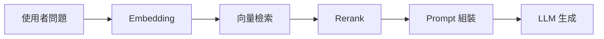
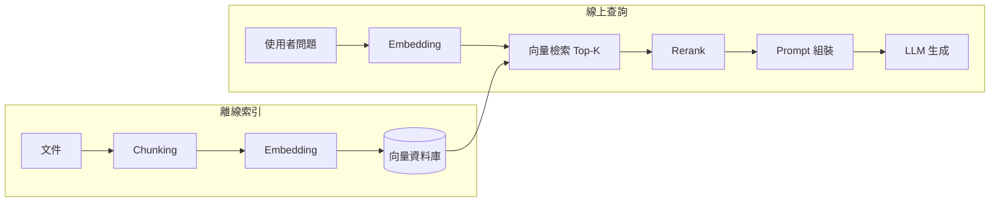

# 互動式技術部落格 Implementation Plan

> **For agentic workers:** REQUIRED SUB-SKILL: Use superpowers:subagent-driven-development (recommended) or superpowers:executing-plans to implement this plan task-by-task. Steps use checkbox (`- [ ]`) syntax for tracking.

**Goal:** 把 singyichen.github.io 改造為 Astro 靜態站:極簡雙主題的 portfolio 首頁 + `/blog` 技術部落格,文章支援內嵌互動元件(Mermaid、markmap、React Flow、Recharts),並以一篇 RAG 技術文章驗證全部功能,GitHub Actions 自動部署。

**Architecture:** Astro 5 靜態輸出 + MDX 文章 + React islands(`client:visible`)。Mermaid/markmap 走「code fence → 客戶端按需渲染」:文章寫 ` ```mermaid `/` ```markmap ` code block,PostLayout 的 client script 找到這些 block、動態載入對應 library 渲染成互動圖(縮放/平移/全螢幕/收合)。雙主題以 CSS custom properties 實作,`data-theme` 屬性切換,React 元件透過 `useThemeTokens` hook 取 token 顏色。

**Tech Stack:** Astro 5, @astrojs/mdx, @astrojs/react, React 19, mermaid, markmap-lib + markmap-view, @xyflow/react, recharts, motion

**Spec:** `docs/superpowers/specs/2026-08-12-interactive-tech-blog-design.md`

**與 spec 的兩處實作偏差(刻意為之):**

1. spec 寫「remark plugin 轉佔位元素」;實作改為 shiki `excludeLangs` 保留原始 code fence + 客戶端偵測渲染。原因:MDX 不吃 remark 產出的 raw `html` node,客戶端偵測更簡單且效果相同(仍是按需載入)。
2. spec 寫圖表基礎設施放 `src/components/diagrams/`;實作放 `src/scripts/diagrams.ts`。原因:它是純 DOM script 不是 Astro/React 元件。

## Global Constraints

- Node.js >= 20(Astro 5 要求;開工前 `node -v` 確認)
- `site: 'https://singyichen.github.io'`,部落格路徑 `/blog`
- 不用 Tailwind;樣式一律原生 CSS custom properties
- 雙主題 tokens:`:root` 淺色、`[data-theme="dark"]` 深色;元件與圖表不得寫死只屬於單一主題的顏色
- 淺色 tokens:`--bg:#fdfdfc --bg-card:#f4f4f2 --text:#1f2328 --text-muted:#6b7280 --accent:#0e7c66 --border:#e5e7e6`
- 深色 tokens(沿用現有 portfolio):`--bg:#0f1115 --bg-card:#161922 --text:#e8e9ec --text-muted:#9096a3 --accent:#7dd3c0 --border:#262a35`
- React 元件一律 `client:visible` 載入
- mermaid / markmap-lib / markmap-view 一律動態 `import()`(按需載入),不進主 bundle
- 內容語言 zh-Hant,`<html lang="zh-Hant">`
- 主題切換時 dispatch `window` 上的 `themechange` CustomEvent(detail 為 `'light' | 'dark'`);所有需要跟主題變色的東西監聽此事件
- 每個 Task 結尾 `npm run build` 必須通過才能 commit

---

### Task 1: Astro 專案骨架

**Files:**
- Create: `package.json`, `astro.config.mjs`, `tsconfig.json`, `.gitignore`, `src/pages/index.astro`(暫時佔位,Task 3 重寫)

**Interfaces:**
- Produces: `npm run dev` / `npm run build` / `npm run preview` 指令;`dist/` 輸出目錄;後續 task 的專案基底

- [ ] **Step 1: 確認 Node 版本**

Run: `node -v`
Expected: v20 以上。若否,停下來回報,不要繼續。

- [ ] **Step 2: 建立 package.json 與安裝依賴**

```bash
npm init -y
npm pkg set type="module" scripts.dev="astro dev" scripts.build="astro build" scripts.preview="astro preview"
npm pkg delete main
npm install astro @astrojs/mdx @astrojs/react react react-dom mermaid markmap-lib markmap-view @xyflow/react recharts motion
```

- [ ] **Step 3: 建立 .gitignore**

```gitignore
node_modules/
dist/
.astro/
```

- [ ] **Step 4: 建立 astro.config.mjs**

```js
import { defineConfig } from 'astro/config';
import mdx from '@astrojs/mdx';
import react from '@astrojs/react';

export default defineConfig({
  site: 'https://singyichen.github.io',
  integrations: [mdx(), react()],
});
```

- [ ] **Step 5: 建立 tsconfig.json**

```json
{
  "extends": "astro/tsconfigs/base",
  "compilerOptions": {
    "jsx": "react-jsx",
    "jsxImportSource": "react"
  }
}
```

- [ ] **Step 6: 建立佔位首頁 src/pages/index.astro**

```astro
---
---
<!doctype html>
<html lang="zh-Hant">
  <head><meta charset="UTF-8" /><title>Mandy Chen</title></head>
  <body><h1>Astro scaffold OK</h1></body>
</html>
```

- [ ] **Step 7: 驗證 build**

Run: `npm run build && grep -q "Astro scaffold OK" dist/index.html && echo PASS`
Expected: build 成功,輸出 `PASS`

- [ ] **Step 8: Commit**

```bash
git add package.json package-lock.json astro.config.mjs tsconfig.json .gitignore src/
git commit -m "feat: scaffold Astro project with MDX and React integrations"
```

---

### Task 2: 雙主題系統 + BaseLayout

**Files:**
- Create: `src/styles/global.css`, `src/layouts/BaseLayout.astro`
- Modify: `src/pages/index.astro`(改用 BaseLayout,內容仍為佔位)

**Interfaces:**
- Produces: `BaseLayout.astro`,Props 為 `{ title: string; description?: string }`,含導覽列(站名 / Blog 連結 / 主題切換鈕 id=`theme-toggle`)、footer、FOUC 防閃 inline script;`themechange` CustomEvent 約定;`global.css` 的全部 design tokens 與基礎樣式

- [ ] **Step 1: 建立 src/styles/global.css**

```css
:root {
  --bg: #fdfdfc;
  --bg-card: #f4f4f2;
  --text: #1f2328;
  --text-muted: #6b7280;
  --accent: #0e7c66;
  --border: #e5e7e6;
  --radius: 14px;
}

[data-theme='dark'] {
  --bg: #0f1115;
  --bg-card: #161922;
  --text: #e8e9ec;
  --text-muted: #9096a3;
  --accent: #7dd3c0;
  --border: #262a35;
}

* { box-sizing: border-box; }

html { color-scheme: light; }
[data-theme='dark'] { color-scheme: dark; }

body {
  margin: 0;
  font-family: -apple-system, BlinkMacSystemFont, 'Segoe UI', 'PingFang TC', 'Noto Sans TC', sans-serif;
  background: var(--bg);
  color: var(--text);
  line-height: 1.75;
}

main { max-width: 720px; margin: 0 auto; padding: 48px 24px 96px; }

a { color: var(--accent); text-decoration: none; }
a:hover { text-decoration: underline; }

.site-nav {
  max-width: 720px;
  margin: 0 auto;
  padding: 20px 24px;
  display: flex;
  align-items: center;
  gap: 20px;
}
.site-nav .site-title { font-weight: 700; color: var(--text); }
.site-nav .spacer { flex: 1; }
.site-nav a { color: var(--text-muted); }
.site-nav a:hover { color: var(--text); text-decoration: none; }

.theme-toggle {
  background: none;
  border: 1px solid var(--border);
  border-radius: 999px;
  padding: 4px 10px;
  cursor: pointer;
  color: var(--text-muted);
  font-size: 14px;
}

.site-footer {
  max-width: 720px;
  margin: 0 auto;
  padding: 24px;
  color: var(--text-muted);
  font-size: 13px;
  border-top: 1px solid var(--border);
}

h1 { font-size: 32px; letter-spacing: -0.01em; line-height: 1.3; }
h2 { font-size: 22px; margin-top: 2em; }
h3 { font-size: 18px; }

code {
  font-family: ui-monospace, SFMono-Regular, Menlo, monospace;
  font-size: 0.9em;
  background: var(--bg-card);
  padding: 2px 6px;
  border-radius: 4px;
}
pre { border-radius: var(--radius); padding: 16px 20px; overflow-x: auto; }
pre code { background: none; padding: 0; }

/* shiki 雙主題:defaultColor 是淺色,深色時套用 --shiki-dark 變數 */
[data-theme='dark'] .astro-code,
[data-theme='dark'] .astro-code span {
  color: var(--shiki-dark) !important;
  background-color: var(--shiki-dark-bg) !important;
}
```

- [ ] **Step 2: 建立 src/layouts/BaseLayout.astro**

```astro
---
import '../styles/global.css';

interface Props {
  title: string;
  description?: string;
}
const { title, description = 'Mandy Chen — AI-Native Backend Engineer 的技術筆記' } = Astro.props;
---

<!doctype html>
<html lang="zh-Hant">
  <head>
    <meta charset="UTF-8" />
    <meta name="viewport" content="width=device-width, initial-scale=1.0" />
    <title>{title}</title>
    <meta name="description" content={description} />
    <script is:inline>
      const saved = localStorage.getItem('theme');
      const theme =
        saved ?? (matchMedia('(prefers-color-scheme: dark)').matches ? 'dark' : 'light');
      document.documentElement.dataset.theme = theme;
    </script>
  </head>
  <body>
    <nav class="site-nav">
      <a class="site-title" href="/">Mandy Chen</a>
      <div class="spacer"></div>
      <a href="/blog">Blog</a>
      <button id="theme-toggle" class="theme-toggle" aria-label="切換深淺主題">◐</button>
    </nav>
    <main><slot /></main>
    <footer class="site-footer">© 2026 Mandy Chen</footer>
    <script>
      document.getElementById('theme-toggle')?.addEventListener('click', () => {
        const next = document.documentElement.dataset.theme === 'dark' ? 'light' : 'dark';
        document.documentElement.dataset.theme = next;
        localStorage.setItem('theme', next);
        window.dispatchEvent(new CustomEvent('themechange', { detail: next }));
      });
    </script>
  </body>
</html>
```

- [ ] **Step 3: index.astro 改用 BaseLayout**

```astro
---
import BaseLayout from '../layouts/BaseLayout.astro';
---
<BaseLayout title="Mandy Chen | AI-Native Backend Engineer">
  <h1>Portfolio 建置中</h1>
</BaseLayout>
```

- [ ] **Step 4: 驗證**

Run: `npm run build && grep -q "theme-toggle" dist/index.html && grep -q "data-theme" dist/index.html || grep -q "dataset.theme" dist/index.html && echo PASS`
Expected: build 成功、輸出 PASS。再 `npm run dev` 開瀏覽器手動確認:主題鈕可切換深淺色、重整後記住選擇、系統深色偏好時預設深色。

- [ ] **Step 5: Commit**

```bash
git add src/
git commit -m "feat: dual-theme system with BaseLayout and FOUC-safe toggle"
```

---

### Task 3: Portfolio 首頁重製

**Files:**
- Modify: `src/pages/index.astro`(以現有 `index.html` 的內容重寫成極簡雙主題版)
- Modify: `src/styles/global.css`(追加 portfolio 需要的樣式)
- Delete: `index.html`(repo 根目錄的舊檔)

**Interfaces:**
- Consumes: `BaseLayout.astro`(Task 2)
- Produces: 正式首頁;無其他 task 依賴

- [ ] **Step 1: 閱讀舊 index.html 取得內容**

`git show HEAD:index.html` 或直接讀根目錄 `index.html`,取出全部文案:名字、title、地點、About、技能標籤群、現職卡片、聯絡連結(GitHub / Email 等)。內容一字不漏搬過去,只有視覺重做。

- [ ] **Step 2: 重寫 src/pages/index.astro**

以 BaseLayout 包裹,結構:eyebrow(職稱)、h1 名字、subtitle、location、About 段落、技能 tag 群組、現職 card、聯絡連結列。全部顏色走 tokens。追加樣式寫進 `global.css`(`.tags`、`.tag`、`.card`、`.link-btn` 等,可從舊檔搬並把寫死的深色值改成 var())。

- [ ] **Step 3: 刪除舊檔**

```bash
git rm index.html
```

- [ ] **Step 4: 驗證**

Run: `npm run build && grep -q "Mandy" dist/index.html && echo PASS`
Expected: PASS。`npm run dev` 手動確認深淺兩主題下 portfolio 內容完整、視覺正常。

- [ ] **Step 5: Commit**

```bash
git add -A
git commit -m "feat: rebuild portfolio homepage in Astro with dual theme"
```

---

### Task 4: 部落格內容模型與頁面

**Files:**
- Create: `src/content.config.ts`, `src/layouts/PostLayout.astro`, `src/pages/blog/index.astro`, `src/pages/blog/[...slug].astro`, `src/pages/blog/tags/[tag].astro`, `src/content/blog/rag-fundamentals.mdx`(先放 frontmatter + 簡短內文,Task 7 擴寫)
- Modify: `src/styles/global.css`(文章列表與文章頁樣式)

**Interfaces:**
- Consumes: `BaseLayout.astro`
- Produces: content collection `blog`(schema: `title: string, description: string, pubDate: date, tags: string[] = [], draft: boolean = false`);`PostLayout.astro` Props `{ title, description, pubDate: Date, tags: string[] }`;路由 `/blog`、`/blog/<id>`、`/blog/tags/<tag>`。文章 slug 即檔名(`rag-fundamentals`)。Task 6 的元件將被此文章 import。

- [ ] **Step 1: 建立 src/content.config.ts**

```ts
import { defineCollection, z } from 'astro:content';
import { glob } from 'astro/loaders';

const blog = defineCollection({
  loader: glob({ pattern: '**/*.mdx', base: './src/content/blog' }),
  schema: z.object({
    title: z.string(),
    description: z.string(),
    pubDate: z.coerce.date(),
    tags: z.array(z.string()).default([]),
    draft: z.boolean().default(false),
  }),
});

export const collections = { blog };
```

- [ ] **Step 2: 建立首篇文章骨架 src/content/blog/rag-fundamentals.mdx**

```mdx
---
title: 'RAG 實戰入門:從檢索到生成的完整拆解'
description: '拆解 RAG pipeline 的每個環節:chunking、embedding、檢索、rerank 到生成,以及每一步的取捨。'
pubDate: 2026-08-12
tags: ['rag', 'llm', 'ai-engineering']
---

RAG(Retrieval-Augmented Generation)是把「檢索」接到「生成」前面的架構。本文骨架,內容由後續 task 補完。
```

- [ ] **Step 3: 建立 src/layouts/PostLayout.astro**

```astro
---
import BaseLayout from './BaseLayout.astro';

interface Props {
  title: string;
  description: string;
  pubDate: Date;
  tags: string[];
}
const { title, description, pubDate, tags } = Astro.props;
const dateStr = pubDate.toISOString().slice(0, 10);
---

<BaseLayout title={`${title} | Mandy Chen`} description={description}>
  <article>
    <header class="post-header">
      <h1>{title}</h1>
      <div class="post-meta">
        <time datetime={dateStr}>{dateStr}</time>
        {tags.map((t) => <a class="post-tag" href={`/blog/tags/${t}`}>{t}</a>)}
      </div>
    </header>
    <slot />
  </article>
</BaseLayout>
```

- [ ] **Step 4: 建立 src/pages/blog/index.astro**

```astro
---
import { getCollection } from 'astro:content';
import BaseLayout from '../../layouts/BaseLayout.astro';

const posts = (await getCollection('blog', ({ data }) => !data.draft)).sort(
  (a, b) => b.data.pubDate.valueOf() - a.data.pubDate.valueOf()
);
---

<BaseLayout title="Blog | Mandy Chen">
  <h1>Blog</h1>
  <ul class="post-list">
    {posts.map((post) => (
      <li class="post-item">
        <time>{post.data.pubDate.toISOString().slice(0, 10)}</time>
        <div>
          <a class="post-title" href={`/blog/${post.id}`}>{post.data.title}</a>
          <div class="post-tags">
            {post.data.tags.map((t) => <a class="post-tag" href={`/blog/tags/${t}`}>{t}</a>)}
          </div>
        </div>
      </li>
    ))}
  </ul>
</BaseLayout>
```

- [ ] **Step 5: 建立 src/pages/blog/[...slug].astro**

```astro
---
import { getCollection, render } from 'astro:content';
import PostLayout from '../../layouts/PostLayout.astro';

export async function getStaticPaths() {
  const posts = await getCollection('blog', ({ data }) => !data.draft);
  return posts.map((post) => ({ params: { slug: post.id }, props: { post } }));
}

const { post } = Astro.props;
const { Content } = await render(post);
---

<PostLayout {...post.data}>
  <Content />
</PostLayout>
```

- [ ] **Step 6: 建立 src/pages/blog/tags/[tag].astro**

```astro
---
import { getCollection } from 'astro:content';
import BaseLayout from '../../../layouts/BaseLayout.astro';

export async function getStaticPaths() {
  const posts = await getCollection('blog', ({ data }) => !data.draft);
  const tags = [...new Set(posts.flatMap((p) => p.data.tags))];
  return tags.map((tag) => ({
    params: { tag },
    props: { posts: posts.filter((p) => p.data.tags.includes(tag)) },
  }));
}

const { tag } = Astro.params;
const { posts } = Astro.props;
const sorted = posts.sort((a, b) => b.data.pubDate.valueOf() - a.data.pubDate.valueOf());
---

<BaseLayout title={`#${tag} | Mandy Chen`}>
  <h1>#{tag}</h1>
  <ul class="post-list">
    {sorted.map((post) => (
      <li class="post-item">
        <time>{post.data.pubDate.toISOString().slice(0, 10)}</time>
        <a class="post-title" href={`/blog/${post.id}`}>{post.data.title}</a>
      </li>
    ))}
  </ul>
</BaseLayout>
```

- [ ] **Step 7: global.css 追加列表/文章樣式**

```css
.post-list { list-style: none; padding: 0; margin: 24px 0; }
.post-item {
  display: flex;
  gap: 16px;
  padding: 14px 0;
  border-bottom: 1px solid var(--border);
  align-items: baseline;
}
.post-item time { color: var(--text-muted); font-size: 14px; white-space: nowrap; font-variant-numeric: tabular-nums; }
.post-title { color: var(--text); font-weight: 600; }
.post-tags { display: inline-flex; gap: 8px; margin-left: 10px; }
.post-tag { font-size: 12px; color: var(--accent); }
.post-tag::before { content: '#'; }
.post-header .post-meta { color: var(--text-muted); font-size: 14px; display: flex; gap: 12px; }
article img, article svg { max-width: 100%; }
```

- [ ] **Step 8: 驗證**

Run: `npm run build && test -f dist/blog/index.html && test -f dist/blog/rag-fundamentals/index.html && test -f dist/blog/tags/rag/index.html && echo PASS`
Expected: PASS

- [ ] **Step 9: Commit**

```bash
git add src/
git commit -m "feat: blog content collection, list, post, and tag pages"
```

---

### Task 5: Mermaid + markmap 圖表基礎設施

**Files:**
- Create: `src/scripts/diagrams.ts`
- Modify: `astro.config.mjs`(shiki excludeLangs)、`src/layouts/PostLayout.astro`(掛載 script)、`src/styles/global.css`(圖表容器樣式)、`src/content/blog/rag-fundamentals.mdx`(加入測試用 mermaid + markmap block)

**Interfaces:**
- Consumes: `themechange` 事件(Task 2)
- Produces: 文章內 ` ```mermaid ` 與 ` ```markmap ` code fence 自動變成互動圖。`initDiagrams(): void` 由 PostLayout 呼叫。Mermaid 容器提供滾輪縮放、拖曳平移、重設、全螢幕;markmap 內建收合/縮放/平移。主題切換時自動以對應主題重渲染。

- [ ] **Step 1: astro.config.mjs 加入 shiki 設定**

讓 shiki 跳過 mermaid/markmap(保留 `<pre><code class="language-mermaid">` 原樣給客戶端),其餘語言用雙主題 highlight:

```js
import { defineConfig } from 'astro/config';
import mdx from '@astrojs/mdx';
import react from '@astrojs/react';

export default defineConfig({
  site: 'https://singyichen.github.io',
  integrations: [mdx(), react()],
  markdown: {
    syntaxHighlight: {
      type: 'shiki',
      excludeLangs: ['mermaid', 'markmap'],
    },
    shikiConfig: {
      themes: { light: 'github-light', dark: 'github-dark' },
    },
  },
});
```

- [ ] **Step 2: 建立 src/scripts/diagrams.ts**

```ts
type DiagramType = 'mermaid' | 'markmap';

interface Block {
  container: HTMLElement;
  source: string;
  type: DiagramType;
}

const blocks: Block[] = [];
let mermaidSeq = 0;

export function initDiagrams(): void {
  document.querySelectorAll('pre > code').forEach((code) => {
    const cls = Array.from(code.classList).find(
      (c) => c === 'language-mermaid' || c === 'language-markmap'
    );
    if (!cls) return;
    const type = cls.slice('language-'.length) as DiagramType;
    const container = document.createElement('div');
    container.className = `diagram diagram-${type}`;
    code.parentElement!.replaceWith(container);
    blocks.push({ container, source: code.textContent ?? '', type });
  });
  if (blocks.length === 0) return;
  void renderAll();
  window.addEventListener('themechange', () => void renderAll());
}

async function renderAll(): Promise<void> {
  const dark = document.documentElement.dataset.theme === 'dark';
  if (blocks.some((b) => b.type === 'mermaid')) await renderMermaid(dark);
  if (blocks.some((b) => b.type === 'markmap')) await renderMarkmap();
}

async function renderMermaid(dark: boolean): Promise<void> {
  const mermaid = (await import('mermaid')).default;
  mermaid.initialize({ startOnLoad: false, theme: dark ? 'dark' : 'default' });
  for (const b of blocks.filter((x) => x.type === 'mermaid')) {
    try {
      const { svg } = await mermaid.render(`mmd-${mermaidSeq++}`, b.source);
      mountInteractive(b.container, svg);
    } catch (err) {
      b.container.innerHTML = `<pre class="diagram-error">Mermaid 渲染失敗:${escapeHtml(
        String(err)
      )}\n\n${escapeHtml(b.source)}</pre>`;
    }
  }
}

async function renderMarkmap(): Promise<void> {
  const [{ Transformer }, { Markmap }] = await Promise.all([
    import('markmap-lib'),
    import('markmap-view'),
  ]);
  const transformer = new Transformer();
  for (const b of blocks.filter((x) => x.type === 'markmap')) {
    try {
      b.container.innerHTML = '<svg class="markmap-svg"></svg>';
      const svg = b.container.querySelector<SVGSVGElement>('svg')!;
      const { root } = transformer.transform(b.source);
      Markmap.create(svg, { autoFit: true }, root);
    } catch (err) {
      b.container.innerHTML = `<pre class="diagram-error">Markmap 渲染失敗:${escapeHtml(
        String(err)
      )}\n\n${escapeHtml(b.source)}</pre>`;
    }
  }
}

function mountInteractive(container: HTMLElement, svg: string): void {
  container.innerHTML = `
    <div class="diagram-toolbar">
      <button class="diagram-btn" data-action="reset" title="重設縮放">⟲</button>
      <button class="diagram-btn" data-action="fullscreen" title="全螢幕">⛶</button>
    </div>
    <div class="diagram-viewport"><div class="diagram-canvas">${svg}</div></div>`;
  const viewport = container.querySelector<HTMLElement>('.diagram-viewport')!;
  const canvas = container.querySelector<HTMLElement>('.diagram-canvas')!;
  let scale = 1;
  let tx = 0;
  let ty = 0;
  const apply = () => {
    canvas.style.transform = `translate(${tx}px, ${ty}px) scale(${scale})`;
  };
  viewport.addEventListener(
    'wheel',
    (e) => {
      e.preventDefault();
      scale = Math.min(8, Math.max(0.3, scale * (e.deltaY < 0 ? 1.15 : 0.87)));
      apply();
    },
    { passive: false }
  );
  let dragging = false;
  let sx = 0;
  let sy = 0;
  viewport.addEventListener('pointerdown', (e) => {
    dragging = true;
    sx = e.clientX - tx;
    sy = e.clientY - ty;
    viewport.setPointerCapture(e.pointerId);
  });
  viewport.addEventListener('pointermove', (e) => {
    if (!dragging) return;
    tx = e.clientX - sx;
    ty = e.clientY - sy;
    apply();
  });
  viewport.addEventListener('pointerup', () => {
    dragging = false;
  });
  container
    .querySelector('[data-action="reset"]')!
    .addEventListener('click', () => {
      scale = 1;
      tx = 0;
      ty = 0;
      apply();
    });
  container
    .querySelector('[data-action="fullscreen"]')!
    .addEventListener('click', () => {
      if (document.fullscreenElement) void document.exitFullscreen();
      else void container.requestFullscreen();
    });
}

function escapeHtml(s: string): string {
  return s.replaceAll('&', '&amp;').replaceAll('<', '&lt;').replaceAll('>', '&gt;');
}
```

- [ ] **Step 3: PostLayout.astro 掛載 script**

在 `</article>` 之後、BaseLayout slot 內加:

```astro
<script>
  import { initDiagrams } from '../scripts/diagrams';
  initDiagrams();
</script>
```

- [ ] **Step 4: global.css 追加圖表樣式**

```css
.diagram {
  position: relative;
  border: 1px solid var(--border);
  border-radius: var(--radius);
  background: var(--bg-card);
  margin: 24px 0;
  overflow: hidden;
}
.diagram-viewport { overflow: hidden; cursor: grab; touch-action: none; }
.diagram-viewport:active { cursor: grabbing; }
.diagram-canvas { transform-origin: 0 0; padding: 16px; width: fit-content; margin: 0 auto; }
.diagram-toolbar {
  position: absolute;
  top: 8px;
  right: 8px;
  z-index: 2;
  display: flex;
  gap: 6px;
}
.diagram-btn {
  background: var(--bg);
  border: 1px solid var(--border);
  border-radius: 6px;
  color: var(--text-muted);
  cursor: pointer;
  padding: 2px 8px;
}
.diagram-btn:hover { color: var(--text); }
.diagram:fullscreen { display: flex; flex-direction: column; }
.diagram:fullscreen .diagram-viewport { flex: 1; display: flex; align-items: center; justify-content: center; }
.diagram-markmap .markmap-svg { width: 100%; height: 420px; }
.diagram-markmap .markmap-svg text { fill: var(--text); }
.diagram-error { color: #c0392b; white-space: pre-wrap; padding: 16px; }
```

- [ ] **Step 5: 文章加入測試圖表**

在 `rag-fundamentals.mdx` 內文加:

````mdx


```markmap
# RAG
## 索引
### Chunking
### Embedding
## 檢索
### Top-K
### Rerank
## 生成
### Prompt 組裝
### 引用來源
```
````

- [ ] **Step 6: 驗證**

Run: `npm run build && grep -q "language-mermaid" dist/blog/rag-fundamentals/index.html && grep -q "language-markmap" dist/blog/rag-fundamentals/index.html && echo PASS`
Expected: PASS(code fence 保留原樣,證明 shiki 沒吃掉)。`npm run dev` 手動確認:兩張圖渲染成功、mermaid 可縮放/平移/全螢幕、markmap 節點可收合、切換主題後 mermaid 變色、無圖表的頁面(如首頁)network 面板沒有載入 mermaid chunk。

- [ ] **Step 7: Commit**

```bash
git add src/ astro.config.mjs
git commit -m "feat: interactive mermaid and markmap rendering with zoom/pan/fullscreen"
```

---

### Task 6: React 互動元件(React Flow + Recharts)

**Files:**
- Create: `src/components/shared/useThemeTokens.ts`, `src/components/posts/rag-fundamentals/RagPipelineFlow.tsx`, `src/components/posts/rag-fundamentals/ChunkSizeChart.tsx`

**Interfaces:**
- Consumes: `themechange` 事件、CSS tokens
- Produces: `useThemeTokens(names: string[]): Record<string, string>`(讀取 `--<name>` token 值,主題切換自動更新);`<RagPipelineFlow />` 逐步演示 RAG pipeline 的互動流程圖;`<ChunkSizeChart />` chunk size 與檢索品質關係的互動折線圖。Task 7 的 MDX 會 import 這兩個元件。

- [ ] **Step 1: 建立 src/components/shared/useThemeTokens.ts**

```ts
import { useEffect, useState } from 'react';

function read(names: string[]): Record<string, string> {
  const style = getComputedStyle(document.documentElement);
  return Object.fromEntries(
    names.map((n) => [n, style.getPropertyValue(`--${n}`).trim()])
  );
}

export function useThemeTokens(names: string[]): Record<string, string> {
  const [tokens, setTokens] = useState<Record<string, string>>({});
  useEffect(() => {
    const update = () => setTokens(read(names));
    update();
    window.addEventListener('themechange', update);
    return () => window.removeEventListener('themechange', update);
    // eslint-disable-next-line react-hooks/exhaustive-deps
  }, []);
  return tokens;
}
```

(SSR 期間不執行 `getComputedStyle`;元件使用時一律給 fallback 色,如 `tokens.accent || '#0e7c66'`。)

- [ ] **Step 2: 建立 RagPipelineFlow.tsx**

```tsx
import { useMemo, useState } from 'react';
import { Background, Controls, ReactFlow, type Edge, type Node } from '@xyflow/react';
import '@xyflow/react/dist/style.css';
import { useThemeTokens } from '../../shared/useThemeTokens';

const STEPS = [
  { id: 'query', label: '使用者問題', desc: '一切從一個自然語言問題開始。' },
  { id: 'embed', label: 'Embedding', desc: '問題被轉成向量,準備跟知識庫比對相似度。' },
  { id: 'retrieve', label: '向量檢索', desc: '從向量資料庫撈出最相近的 Top-K 個 chunk。' },
  { id: 'rerank', label: 'Rerank', desc: '用更精準(也更貴)的模型重排,把真正相關的排到前面。' },
  { id: 'prompt', label: 'Prompt 組裝', desc: '把篩選後的 chunk 塞進 prompt,附上引用規則。' },
  { id: 'generate', label: 'LLM 生成', desc: '模型基於檢索到的內容作答,並標註來源。' },
];

export default function RagPipelineFlow() {
  const [step, setStep] = useState(0);
  const t = useThemeTokens(['bg-card', 'text', 'accent', 'border']);
  const accent = t['accent'] || '#0e7c66';

  const nodes: Node[] = useMemo(
    () =>
      STEPS.map((s, i) => ({
        id: s.id,
        position: { x: (i % 3) * 220, y: Math.floor(i / 3) * 140 },
        data: { label: s.label },
        style: {
          background: t['bg-card'] || '#f4f4f2',
          color: t['text'] || '#1f2328',
          border: `2px solid ${i <= step ? accent : t['border'] || '#e5e7e6'}`,
          borderRadius: 10,
          opacity: i <= step ? 1 : 0.5,
          fontWeight: i === step ? 700 : 400,
        },
      })),
    [step, t]
  );

  const edges: Edge[] = useMemo(
    () =>
      STEPS.slice(1).map((s, i) => ({
        id: `e${i}`,
        source: STEPS[i].id,
        target: s.id,
        animated: i + 1 === step,
        style: { stroke: i < step ? accent : t['border'] || '#e5e7e6', strokeWidth: 2 },
      })),
    [step, t]
  );

  return (
    <div className="flow-demo">
      <div style={{ height: 340 }}>
        <ReactFlow nodes={nodes} edges={edges} fitView proOptions={{ hideAttribution: true }}>
          <Background />
          <Controls showInteractive={false} />
        </ReactFlow>
      </div>
      <div className="flow-demo-panel">
        <p>
          <strong>
            {step + 1}/{STEPS.length}:{STEPS[step].label}
          </strong>
          {' — '}
          {STEPS[step].desc}
        </p>
        <button onClick={() => setStep((s) => Math.max(0, s - 1))} disabled={step === 0}>
          ← 上一步
        </button>{' '}
        <button
          onClick={() => setStep((s) => Math.min(STEPS.length - 1, s + 1))}
          disabled={step === STEPS.length - 1}
        >
          下一步 →
        </button>{' '}
        <button onClick={() => setStep(0)}>重播</button>
      </div>
    </div>
  );
}
```

- [ ] **Step 3: 建立 ChunkSizeChart.tsx**

```tsx
import { useState } from 'react';
import {
  CartesianGrid,
  Legend,
  Line,
  LineChart,
  ResponsiveContainer,
  Tooltip,
  XAxis,
  YAxis,
} from 'recharts';
import { useThemeTokens } from '../../shared/useThemeTokens';

type Point = { chunk: number; recall: number; faithfulness: number };

const DATA: Record<string, Point[]> = {
  '0': [
    { chunk: 128, recall: 0.58, faithfulness: 0.9 },
    { chunk: 256, recall: 0.7, faithfulness: 0.88 },
    { chunk: 512, recall: 0.79, faithfulness: 0.84 },
    { chunk: 1024, recall: 0.82, faithfulness: 0.76 },
    { chunk: 2048, recall: 0.8, faithfulness: 0.65 },
  ],
  '10': [
    { chunk: 128, recall: 0.63, faithfulness: 0.9 },
    { chunk: 256, recall: 0.75, faithfulness: 0.89 },
    { chunk: 512, recall: 0.83, faithfulness: 0.85 },
    { chunk: 1024, recall: 0.85, faithfulness: 0.77 },
    { chunk: 2048, recall: 0.82, faithfulness: 0.66 },
  ],
  '20': [
    { chunk: 128, recall: 0.66, faithfulness: 0.89 },
    { chunk: 256, recall: 0.78, faithfulness: 0.88 },
    { chunk: 512, recall: 0.85, faithfulness: 0.84 },
    { chunk: 1024, recall: 0.86, faithfulness: 0.75 },
    { chunk: 2048, recall: 0.83, faithfulness: 0.64 },
  ],
};

export default function ChunkSizeChart() {
  const [overlap, setOverlap] = useState('10');
  const t = useThemeTokens(['accent', 'text-muted', 'border', 'text', 'bg-card']);
  const accent = t['accent'] || '#0e7c66';
  const muted = t['text-muted'] || '#6b7280';

  return (
    <div className="chart-demo">
      <div className="chart-demo-controls">
        chunk overlap:
        {['0', '10', '20'].map((o) => (
          <button key={o} className={o === overlap ? 'active' : ''} onClick={() => setOverlap(o)}>
            {o}%
          </button>
        ))}
        <span className="chart-note">(示意資料,非實測)</span>
      </div>
      <ResponsiveContainer width="100%" height={300}>
        <LineChart data={DATA[overlap]} margin={{ top: 8, right: 16, bottom: 8, left: 0 }}>
          <CartesianGrid stroke={t['border'] || '#e5e7e6'} strokeDasharray="3 3" />
          <XAxis dataKey="chunk" stroke={muted} tick={{ fill: muted }} />
          <YAxis domain={[0.5, 1]} stroke={muted} tick={{ fill: muted }} />
          <Tooltip
            contentStyle={{
              background: t['bg-card'] || '#f4f4f2',
              border: `1px solid ${t['border'] || '#e5e7e6'}`,
              color: t['text'] || '#1f2328',
            }}
          />
          <Legend />
          <Line type="monotone" dataKey="recall" name="Recall" stroke={accent} strokeWidth={2} />
          <Line
            type="monotone"
            dataKey="faithfulness"
            name="Faithfulness"
            stroke={muted}
            strokeWidth={2}
          />
        </LineChart>
      </ResponsiveContainer>
    </div>
  );
}
```

- [ ] **Step 4: global.css 追加元件樣式**

```css
.flow-demo, .chart-demo {
  border: 1px solid var(--border);
  border-radius: var(--radius);
  background: var(--bg-card);
  padding: 16px;
  margin: 24px 0;
}
.flow-demo-panel { margin-top: 12px; }
.flow-demo-panel button, .chart-demo-controls button {
  background: var(--bg);
  border: 1px solid var(--border);
  border-radius: 6px;
  color: var(--text);
  cursor: pointer;
  padding: 4px 12px;
}
.flow-demo-panel button:disabled { opacity: 0.4; cursor: default; }
.chart-demo-controls { display: flex; align-items: center; gap: 8px; margin-bottom: 12px; color: var(--text-muted); font-size: 14px; }
.chart-demo-controls button.active { border-color: var(--accent); color: var(--accent); }
.chart-note { font-size: 12px; }
```

- [ ] **Step 5: 暫掛驗證**

在 `rag-fundamentals.mdx` frontmatter 之後加 import 並放入內文(位置隨意,Task 7 會重排):

```mdx
import RagPipelineFlow from '../../components/posts/rag-fundamentals/RagPipelineFlow.tsx';
import ChunkSizeChart from '../../components/posts/rag-fundamentals/ChunkSizeChart.tsx';

<RagPipelineFlow client:visible />
<ChunkSizeChart client:visible />
```

- [ ] **Step 6: 驗證**

Run: `npm run build && echo PASS`
Expected: PASS。`npm run dev` 手動確認:流程圖可逐步導覽、節點可拖曳;圖表可切 overlap、hover 有 tooltip;切換主題兩個元件顏色跟著變。

- [ ] **Step 7: Commit**

```bash
git add src/
git commit -m "feat: RagPipelineFlow and ChunkSizeChart interactive components"
```

---

### Task 7: RAG 技術文章完稿

**Files:**
- Modify: `src/content/blog/rag-fundamentals.mdx`(擴寫成完整文章)

**Interfaces:**
- Consumes: Task 5 的 mermaid/markmap fence、Task 6 的兩個元件
- Produces: 首發文章,整合全部四種互動元素

- [ ] **Step 1: 擴寫文章**

以下為文章全文結構與內容基準(可潤飾語句,但章節、圖表位置、技術內容照此):

````mdx
---
title: 'RAG 實戰入門:從檢索到生成的完整拆解'
description: '拆解 RAG pipeline 的每個環節:chunking、embedding、檢索、rerank 到生成,以及每一步的取捨。'
pubDate: 2026-08-12
tags: ['rag', 'llm', 'ai-engineering']
---

import RagPipelineFlow from '../../components/posts/rag-fundamentals/RagPipelineFlow.tsx';
import ChunkSizeChart from '../../components/posts/rag-fundamentals/ChunkSizeChart.tsx';

LLM 知道的東西停在訓練資料的截止日,也不知道你公司內部的任何文件。RAG(Retrieval-Augmented Generation)用最直觀的方式補上這塊:回答之前,先把相關資料「檢索」出來塞進 prompt。概念一句話講完,但每個環節都有坑。這篇把 pipeline 拆開來一段一段看。

## 整體流程

先看全貌。一個典型的 RAG pipeline 長這樣:



重點:左半邊是**離線**的(文件進來時做一次),右半邊是**線上**的(每個問題都要跑)。兩邊用同一個 embedding 模型,不然向量空間對不上。

## 逐步走一遍

下面這張圖可以按「下一步」逐步看資料怎麼流(節點也可以拖曳):

<RagPipelineFlow client:visible />

## Chunking:最不起眼但影響最大的一步

文件不能整篇塞進向量資料庫 —— embedding 模型有長度上限,而且檢索的粒度太粗會撈回一堆不相關內容。所以要切塊(chunking)。切多大是第一個要做的取捨:

- **chunk 太小**:單一 chunk 缺乏上下文,recall 差 —— 答案被切碎在多個 chunk 裡,撈不齊。
- **chunk 太大**:recall 起初變好,但塞進 prompt 的雜訊變多,生成的 faithfulness(忠實度)下滑,成本也上升。

下面的互動圖表可以切換 overlap 比例,觀察兩個指標的走勢(示意資料):

<ChunkSizeChart client:visible />

一般起手式:**512 tokens 左右、10–20% overlap**,再依評測結果調整。比大小更重要的是**切在語意邊界上**(標題、段落),而不是硬切固定長度。

## 檢索之後:Rerank 為什麼值得

向量相似度是「快而粗」的篩選 —— bi-encoder 把問題和文件分開編碼,只能抓大方向。Rerank 用 cross-encoder 把「問題 + 候選 chunk」一起讀,精準得多但貴得多。所以流程設計成漏斗:向量檢索先撈 Top-50,rerank 從中挑 Top-5 進 prompt。錢花在刀口上。

## RAG 知識地圖

整個領域的知識架構,可以收合展開慢慢看:

```markmap
# RAG
## 索引階段
### Chunking
#### 固定長度 vs 語意切分
#### Overlap 策略
### Embedding
#### 模型選擇
#### 維度與成本
## 檢索階段
### 向量檢索(Top-K)
### 混合檢索(+BM25)
### Rerank(cross-encoder)
## 生成階段
### Prompt 組裝
### 引用來源
### 幻覺抑制
## 評測
### Recall / Precision
### Faithfulness
### 端到端評測
```

## 常見陷阱

1. **只評測生成、不評測檢索。** 檢索撈錯,後面全錯。先量 retrieval recall,再量端到端。
2. **索引和查詢用了不同的 embedding 模型版本。** 向量空間不相容,相似度失去意義。
3. **把 RAG 當萬靈丹。** 需要跨文件推理、彙總統計的問題,單輪檢索救不了,要考慮 agentic 檢索或預先彙整。

## 結語

RAG 的本質是工程,不是魔法:每個環節都是明確的取捨,而取捨要靠評測數字說話。先讓 pipeline 跑起來,再用評測驅動逐段優化 —— 這比一開始就堆滿花式技巧有效得多。
````

- [ ] **Step 2: 驗證**

Run: `npm run build && grep -q "Chunking" dist/blog/rag-fundamentals/index.html && echo PASS`
Expected: PASS。`npm run dev` 手動走完整篇:兩張 code-fence 圖 + 兩個 React 元件都正常、深淺主題都檢查。

- [ ] **Step 3: Commit**

```bash
git add src/
git commit -m "feat: complete RAG fundamentals article with all interactive elements"
```

---

### Task 8: 部署與寫作流程文件

**Files:**
- Create: `.github/workflows/deploy.yml`
- Modify: `CLAUDE.md`(repo 已有另一 session 建立的版本,更新而非覆蓋)

**Interfaces:**
- Consumes: 完整可 build 的專案
- Produces: push `main` 自動部署;CLAUDE.md 反映實作後的真實狀態

- [ ] **Step 1: 建立 .github/workflows/deploy.yml**

```yaml
name: Deploy to GitHub Pages

on:
  push:
    branches: [main]
  workflow_dispatch:

permissions:
  contents: read
  pages: write
  id-token: write

jobs:
  build:
    runs-on: ubuntu-latest
    steps:
      - uses: actions/checkout@v4
      - uses: withastro/action@v3

  deploy:
    needs: build
    runs-on: ubuntu-latest
    environment:
      name: github-pages
      url: ${{ steps.deployment.outputs.page_url }}
    steps:
      - name: Deploy to GitHub Pages
        id: deployment
        uses: actions/deploy-pages@v4
```

- [ ] **Step 2: 建立 CLAUDE.md**

```markdown
# singyichen.github.io

Astro 5 靜態站:portfolio 首頁 + `/blog` 技術部落格。雙主題(`data-theme` + CSS tokens)。

## 指令

- `npm run dev` — 開發伺服器
- `npm run build` — 產出 dist/(commit 前必須通過)

## 寫文章

1. 在 `src/content/blog/<slug>.mdx` 建檔,frontmatter 必填 `title`、`description`、`pubDate`,選填 `tags`、`draft`
2. 流程圖/時序圖:直接寫 ` ```mermaid ` code fence(客戶端渲染,含縮放/平移/全螢幕)
3. 心智圖:寫 ` ```markmap ` code fence,內容是巢狀 markdown 清單(可收合/縮放)
4. 互動元件(artifacts):作者用自然語言描述需求,Claude 產生 React 元件到
   `src/components/posts/<slug>/`,在 MDX 中 import 並以 `client:visible` 使用

## 元件約定

- 顏色一律透過 `useThemeTokens`(`src/components/shared/useThemeTokens.ts`)讀 CSS tokens,
  並提供 fallback 色;監聽 `themechange` 事件已由 hook 處理
- 重量級 library 動態 `import()`,勿進主 bundle
- 不用 Tailwind,樣式寫進 `src/styles/global.css` 用既有 tokens
```

- [ ] **Step 3: 驗證與推送**

Run: `npm run build && echo PASS`
Expected: PASS

```bash
git add .github/ CLAUDE.md
git commit -m "feat: GitHub Actions deploy workflow and writing conventions"
git push
```

- [ ] **Step 4: 提醒使用者手動設定**

告知使用者:到 GitHub repo → Settings → Pages → Build and deployment → Source 改為 **GitHub Actions**,然後到 Actions 分頁確認 workflow 跑綠,開 https://singyichen.github.io 與 /blog 驗收。
