# Phase B 內容組織層 Implementation Plan

> **For agentic workers:** REQUIRED SUB-SKILL: Use superpowers:subagent-driven-development (recommended) or superpowers:executing-plans to implement this plan task-by-task. Steps use checkbox (`- [ ]`) syntax for tracking.

**Goal:** 把 `/blog` 從純文章列表升級成儀表板式知識庫,並補上系列連載、標籤總覽與巢狀資料夾路由。

**Architecture:** 所有「build 期就確定」的資料(排序、標籤計數、系列組裝、前後章)算在 `src/lib/` 的純函式裡,以 vitest 覆蓋;所有「只存在讀者瀏覽器」的閱讀狀態一律在 React island 內部經由 `src/lib/reading-progress.ts` 讀取,絕不由 Astro 傳入。需要疊閱讀狀態的區塊整塊做成一個 `client:load` island,props 只吃可 JSON 序列化的純資料;不需要閱讀狀態的區塊(標籤雲、系列導航)維持純 Astro 靜態渲染,不進 JS bundle。

**Tech Stack:** Astro 6(static output)、React 19 islands、vitest(僅測 `src/lib/`)、原生 CSS custom properties(不用 Tailwind)。本階段**不新增任何 npm 依賴**。

**Spec:** `docs/superpowers/specs/2026-08-16-knowledge-base-upgrade-design.md`(B 階段:「內容組織層(B)」整節、「路由地圖」、「資料模型」、「樣式」)

## Global Constraints

- **Node 版本**:所有 npm / node 指令前加 `PATH="/opt/homebrew/opt/node@22/bin:$PATH"`。Astro 6 要求 Node >= 22.12,本機預設 `node` 是 v20。已確認加上 PATH 後為 v22.23.2。
- 根目錄的 `node_modules/` 已存在,**本階段不需要 `npm install`**(不新增依賴)。
- 不引入 Tailwind。所有顏色取自 `src/styles/global.css` 的 CSS tokens,不在 CSS 或 JS 裡 hardcode 色值。
- **`useThemeTokens` 不用在本階段任何元件**。B 的元件全是純 DOM,一律 CSS class + `var(--token)`。`useThemeTokens` 只保留給需要把顏色當 JS 值傳給繪圖庫的元件(recharts、xyflow)。
- 文章頁閱讀寬度維持 **720px**;Dashboard 與系列頁 **1080px**。寬度只在 `global.css` 一處定義,各頁不得自己覆寫。
- localStorage key 固定 `blog:progress:v1` / `blog:favorites:v1`,本階段不改形狀、不換版號。
- 判定門檻一律取自 `reading-progress.ts` 的 `STARTED_PCT`(5)/ `FINISHED_PCT`(90),**不在任何元件裡重寫數字**。
- 元件不得直接碰 `localStorage`,一律經過 `src/lib/reading-progress.ts`。
- 任一區塊無資料就整塊不顯示,**不留空殼**(不出現空框、不出現「暫無資料」佔位)。
- 需要閱讀狀態的區塊一律 `client:load`,不用 `client:visible`(Dashboard 首屏就看得到,等進視窗才掛載會看到內容跳動)。
- 每個 task 結束前 `PATH="/opt/homebrew/opt/node@22/bin:$PATH" npm run build` 與 `npm test` 都必須通過。
- 深、淺兩種主題各檢查一次,用 nav 上的主題切換鈕觸發 `themechange`。
- Commit 訊息用繁體中文描述,結尾加 `Co-Authored-By: Claude Opus 5 (1M context) <noreply@anthropic.com>`。

## 本計畫對 spec 的三處修正

執行時以本節為準,spec 的對應敘述已過時。理由寫在這裡,不要在實作時再推翻一次。

1. **寬版 class 掛在 `<body>` 而非 `<main>`。** spec 寫 `main.is-wide`,但 `global.css` 的 `.site-nav`(第 52 行)與 `.site-footer`(第 75 行)也各自寫死 `max-width: 720px`。只放寬 `main` 會讓 1080px 的內容配上 720px 的置中導覽列,視覺上像跑版。改成 `BaseLayout` 在 `<body>` 加 `is-wide`,CSS 一次放寬三者。寬度仍然只定義在 `global.css` 一處,spec 的原意沒有被違反。

2. **`neighbors()` 的 `index` 是章節在排序後陣列中的 1-based 位置,不是 `seriesOrder` 的值。** spec 說「`seriesOrder` 決定第 N 章」。改成用位置,是為了讓 `seriesOrder` 可以寫 10 / 20 / 30 留插入空間,而顯示仍是「第 1 章 / 共 3 章」。`seriesOrder` 只負責排序。

3. **`--pending` token 不在本階段加。** spec 的樣式表把 `--pending` 標為 C 階段。B 只加 `--series`。

## File Structure

| 檔案 | 責任 |
| --- | --- |
| `src/content.config.ts` | 修改:schema 加 `series` / `seriesOrder` / `updatedAt` 與 superRefine |
| `src/data/series.ts` | 新增:系列元資料常數 `SERIES` |
| `src/lib/posts.ts` | 新增:`PostSummary` / `PostCard` 與排序、標籤計數、統計 |
| `src/lib/posts.test.ts` | 新增:上者的 vitest |
| `src/lib/series.ts` | 新增:`seriesFieldsError` / `buildSeries` / `neighbors` |
| `src/lib/series.test.ts` | 新增:上者的 vitest,含三種 build 期錯誤 |
| `src/lib/reading-progress.ts` | 修改:新增 `statusOf` / `pctOf` / `summarize` |
| `src/lib/reading-progress.test.ts` | 修改:補上三個新函式的測試 |
| `src/components/blog/ReadStatusDot.tsx` | 新增:三種形狀的狀態記號 |
| `src/components/blog/ReadCount.tsx` | 新增:KPI「已讀完 N 篇」 |
| `src/components/blog/PostList.tsx` | 新增:帶狀態記號的文章列 |
| `src/components/blog/ResumeCard.tsx` | 新增:Dashboard 繼續閱讀卡片 |
| `src/components/blog/FavoriteList.tsx` | 新增:Dashboard 收藏區塊 |
| `src/components/blog/SeriesRail.tsx` | 新增:系列卡片列(Dashboard 與 `/blog/series` 共用) |
| `src/components/blog/ChapterList.tsx` | 新增:系列頁的章節列(需要閱讀狀態,故為 island) |
| `src/layouts/BaseLayout.astro` | 修改:新增 `wide` prop |
| `src/layouts/PostLayout.astro` | 修改:文章結尾的系列導航 |
| `src/pages/blog/index.astro` | 改寫:列表 → Dashboard |
| `src/pages/blog/series/index.astro` | 新增:系列列表 |
| `src/pages/blog/series/[id].astro` | 新增:單一系列 |
| `src/pages/blog/tags/index.astro` | 新增:標籤總覽(純靜態) |
| `src/pages/blog/[...slug].astro` | 修改:算好系列導航資料傳給 PostLayout |
| `src/content/blog/rag-fundamentals.mdx` | 修改:frontmatter 加 `series` / `seriesOrder` / `updatedAt` |
| `src/content/blog/rag/architecture.mdx` | 新增:系列第 2 章,同時驗證巢狀資料夾路由 |
| `src/styles/global.css` | 修改:`--series` token、寬版、本階段所有元件樣式 |
| `.claude/uiprobe/probe.mjs` | 修改:新增 `--seed` 選項與 `dashboard` 指令 |
| `CLAUDE.md` | 修改:補三個 frontmatter 欄位與 `src/data/series.ts` 維護方式 |

### 路由衝突的兩條硬規則

`src/pages/blog/[...slug].astro` 是 rest 路由,會吃掉 `/blog/` 底下所有路徑。Astro 的優先序是「靜態 > 具名參數 > rest 參數」,所以本階段新增的頁面都會贏過它。但這帶來兩條不可違反的規則:

1. **不得建立 `src/content/blog/series/` 或 `src/content/blog/tags/` 資料夾。** 那會產生 `/blog/series/<檔名>` 這種與新頁面撞號的路由。
2. 新增頁面時一律用 `index.astro`(靜態)或具名參數 `[id].astro`,不要再開第二個 rest 路由。

---

### Task 1: schema 擴充與系列元資料

**Files:**
- Modify: `src/content.config.ts`
- Create: `src/data/series.ts`
- Create: `src/lib/series.ts`(本 task 只放 `seriesFieldsError`,其餘函式在 Task 3)
- Create: `src/lib/series.test.ts`

**Interfaces:**
- Consumes: 無(第一個 task)
- Produces:
  - `src/data/series.ts` → `export type SeriesMeta = { title: string; description: string }`、`export type SeriesRegistry = Record<string, SeriesMeta>`、`export const SERIES: SeriesRegistry`
  - `src/lib/series.ts` → `export function seriesFieldsError(data: { series?: string; seriesOrder?: number }): string | null`
  - `src/content.config.ts` 的 schema 多出 `series?: string`、`seriesOrder?: number`、`updatedAt?: Date`

**為什麼 superRefine 呼叫純函式而不是把邏輯寫在 schema 裡:** `content.config.ts` 的 `z` 來自 `astro:content`,vitest 無法解析這個虛擬模組,schema 本身測不到。把「兩個欄位必須同時存在或同時不存在」抽成零依賴的純函式,vitest 就測得到,schema 只負責把錯誤訊息接出去。

- [ ] **Step 1: 寫失敗的測試**

建立 `src/lib/series.test.ts`:

```ts
import { describe, expect, it } from 'vitest';
import { seriesFieldsError } from './series';

describe('seriesFieldsError', () => {
  it('兩個欄位都沒填時合法', () => {
    expect(seriesFieldsError({})).toBeNull();
  });

  it('兩個欄位都填時合法', () => {
    expect(seriesFieldsError({ series: 'rag-101', seriesOrder: 1 })).toBeNull();
  });

  it('只填 series 時回傳訊息,且訊息點名缺少的是 seriesOrder', () => {
    const msg = seriesFieldsError({ series: 'rag-101' });
    expect(msg).toContain('seriesOrder');
  });

  it('只填 seriesOrder 時回傳訊息,且訊息點名缺少的是 series', () => {
    const msg = seriesFieldsError({ seriesOrder: 2 });
    expect(msg).toContain('series');
  });

  it('seriesOrder 為 0 時視為有填,不可被當成未填', () => {
    expect(seriesFieldsError({ series: 'rag-101', seriesOrder: 0 })).toBeNull();
    expect(seriesFieldsError({ seriesOrder: 0 })).toContain('series');
  });
});
```

- [ ] **Step 2: 跑測試確認失敗**

Run: `PATH="/opt/homebrew/opt/node@22/bin:$PATH" npx vitest run src/lib/series.test.ts`
Expected: FAIL,錯誤是找不到 `./series` 模組。

- [ ] **Step 3: 寫最小實作**

建立 `src/lib/series.ts`:

```ts
/**
 * `series` 與 `seriesOrder` 必須同時存在或同時不存在。
 *
 * 這個判斷被 `src/content.config.ts` 的 zod superRefine 呼叫。之所以抽成純函式,
 * 是因為 schema 裡的 `z` 來自 `astro:content` 這個虛擬模組,vitest 解析不到,
 * schema 本身測不了;抽出來才測得到。
 *
 * 注意用 `=== undefined` 而不是 truthy 判斷:`seriesOrder: 0` 是合法的章節序。
 */
export function seriesFieldsError(data: {
  series?: string;
  seriesOrder?: number;
}): string | null {
  const hasSeries = data.series !== undefined;
  const hasOrder = data.seriesOrder !== undefined;
  if (hasSeries === hasOrder) return null;
  return hasSeries
    ? '有 series 就必須一併填 seriesOrder,否則章節順序無法決定'
    : '有 seriesOrder 就必須一併填 series,否則不知道屬於哪個系列';
}
```

- [ ] **Step 4: 跑測試確認通過**

Run: `PATH="/opt/homebrew/opt/node@22/bin:$PATH" npx vitest run src/lib/series.test.ts`
Expected: PASS,5 個測試全過。

- [ ] **Step 5: 建立系列元資料常數**

建立 `src/data/series.ts`:

```ts
/**
 * 系列的標題與描述集中在這裡,不重複寫在每篇文章的 frontmatter。
 *
 * 新增系列的方式:在這裡加一個 key,然後在文章 frontmatter 寫
 * `series: '<key>'` 與 `seriesOrder: <數字>`。
 *
 * 章節序建議用 10 / 20 / 30 這種間隔值,日後要在中間插一章時不必重編全部號碼
 * (顯示的「第 N 章」取的是排序後的位置,不是 seriesOrder 的值)。
 *
 * 只在這裡登記、還沒有任何文章掛上去的系列不會產生頁面,也不會讓 build 失敗 ——
 * 那只是先佔了名字還沒開始寫。反過來,文章的 series 指向這裡沒有的 key 會讓
 * build 失敗(見 src/lib/series.ts 的 buildSeries)。
 */
export interface SeriesMeta {
  title: string;
  description: string;
}

export type SeriesRegistry = Record<string, SeriesMeta>;

export const SERIES: SeriesRegistry = {
  'rag-101': {
    title: 'RAG 從零到一',
    description: '把外部知識接進 LLM 的完整路徑,從 pipeline 拆解到企業級架構。',
  },
};
```

- [ ] **Step 6: 擴充 content schema**

把 `src/content.config.ts` 整份換成:

```ts
import { defineCollection, z } from 'astro:content';
import { glob } from 'astro/loaders';
import { seriesFieldsError } from './lib/series';

const blog = defineCollection({
  loader: glob({ pattern: '**/*.mdx', base: './src/content/blog' }),
  schema: z
    .object({
      title: z.string(),
      description: z.string(),
      pubDate: z.coerce.date(),
      tags: z.array(z.string()).default([]),
      draft: z.boolean().default(false),
      /** 系列 id,對應 src/data/series.ts 的 key */
      series: z.string().optional(),
      /** 章節序,只決定排序;顯示的「第 N 章」取排序後的位置 */
      seriesOrder: z.number().optional(),
      /** Dashboard「最近更新」排序用;未填則視為等同 pubDate */
      updatedAt: z.coerce.date().optional(),
    })
    .superRefine((data, ctx) => {
      const msg = seriesFieldsError(data);
      if (msg !== null) {
        ctx.addIssue({ code: z.ZodIssueCode.custom, message: msg, path: ['series'] });
      }
    }),
});

export const collections = { blog };
```

- [ ] **Step 7: 確認 build 通過**

Run: `PATH="/opt/homebrew/opt/node@22/bin:$PATH" npm run build`
Expected: 成功。既有文章沒有 series 欄位,superRefine 回傳 null,不受影響。

- [ ] **Step 8: 手動確認 superRefine 真的會擋**

暫時在 `src/content/blog/rag-fundamentals.mdx` 的 frontmatter 加一行 `series: 'rag-101'`(**不加** seriesOrder),跑 build。

Run: `PATH="/opt/homebrew/opt/node@22/bin:$PATH" npm run build`
Expected: FAIL,訊息含「有 series 就必須一併填 seriesOrder」。確認後把這行**移除**,再跑一次 build 確認回到成功。

- [ ] **Step 9: Commit**

```bash
git add src/content.config.ts src/data/series.ts src/lib/series.ts src/lib/series.test.ts
git commit -m "$(cat <<'EOF'
feat: 內容 schema 加入系列與更新日期欄位

series 與 seriesOrder 必須成對出現,判斷抽成純函式讓 vitest 測得到 ——
schema 裡的 z 來自 astro:content 虛擬模組,vitest 解析不了。

Co-Authored-By: Claude Opus 5 (1M context) <noreply@anthropic.com>
EOF
)"
```

---

### Task 2: `src/lib/posts.ts` 文章資料函式

**Files:**
- Create: `src/lib/posts.ts`
- Create: `src/lib/posts.test.ts`

**Interfaces:**
- Consumes: 無
- Produces:
  - `export interface PostEntryLike { id: string; data: { title: string; description: string; pubDate: Date; tags: string[]; series?: string; seriesOrder?: number; updatedAt?: Date } }`
  - `export interface PostSummary { slug: string; title: string; description: string; pubDate: Date; updatedAt: Date; tags: string[]; series?: string; seriesOrder?: number }`
  - `export interface PostCard { slug: string; title: string; description: string; date: string; isUpdated: boolean; tags: string[] }`
  - `export function isoDate(d: Date): string`
  - `export function toSummary(entry: PostEntryLike): PostSummary`
  - `export function toCard(post: PostSummary): PostCard`
  - `export function sortByDate(posts: PostSummary[], key?: 'pubDate' | 'updatedAt'): PostSummary[]`
  - `export function countTags(posts: PostSummary[]): Array<{ tag: string; count: number }>`
  - `export function stats(posts: PostSummary[]): { total: number; seriesCount: number; tagCount: number }`

**兩個型別為什麼要分開:** `PostSummary` 帶 `Date` 物件,給 Astro 在伺服器端排序用。`PostCard` 全是字串與布林,是**傳進 island 的唯一形狀** —— spec 規定 island 的 props 只吃可 JSON 序列化的純資料。日期在伺服器格式化好,client 端不做 `Date` 運算。

**`toSummary` 為什麼不吃 `CollectionEntry<'blog'>`:** 那個型別來自 `astro:content`,會把這個檔案綁死在 Astro 上,vitest 也難處理。改用結構相同的 `PostEntryLike`,`CollectionEntry<'blog'>` 會自動符合。

- [ ] **Step 1: 寫失敗的測試**

建立 `src/lib/posts.test.ts`:

```ts
import { describe, expect, it } from 'vitest';
import {
  countTags,
  isoDate,
  sortByDate,
  stats,
  toCard,
  toSummary,
  type PostSummary,
} from './posts';

const summary = (over: Partial<PostSummary> = {}): PostSummary => ({
  slug: 'a',
  title: 'A',
  description: 'desc',
  pubDate: new Date('2026-01-01'),
  updatedAt: new Date('2026-01-01'),
  tags: [],
  ...over,
});

describe('isoDate', () => {
  it('輸出 YYYY-MM-DD', () => {
    expect(isoDate(new Date('2026-08-17'))).toBe('2026-08-17');
  });
});

describe('toSummary', () => {
  it('未填 updatedAt 時 updatedAt 等同 pubDate', () => {
    const s = toSummary({
      id: 'x',
      data: { title: 'T', description: 'D', pubDate: new Date('2026-03-01'), tags: [] },
    });
    expect(s.updatedAt).toEqual(new Date('2026-03-01'));
  });

  it('有填 updatedAt 時用填的值', () => {
    const s = toSummary({
      id: 'x',
      data: {
        title: 'T',
        description: 'D',
        pubDate: new Date('2026-03-01'),
        tags: [],
        updatedAt: new Date('2026-05-01'),
      },
    });
    expect(s.updatedAt).toEqual(new Date('2026-05-01'));
  });

  it('slug 取自 entry.id,系列欄位原樣帶出', () => {
    const s = toSummary({
      id: 'rag/architecture',
      data: {
        title: 'T',
        description: 'D',
        pubDate: new Date('2026-03-01'),
        tags: ['rag'],
        series: 'rag-101',
        seriesOrder: 2,
      },
    });
    expect(s.slug).toBe('rag/architecture');
    expect(s.series).toBe('rag-101');
    expect(s.seriesOrder).toBe(2);
  });
});

describe('toCard', () => {
  it('date 取 updatedAt', () => {
    const c = toCard(summary({ updatedAt: new Date('2026-06-15') }));
    expect(c.date).toBe('2026-06-15');
  });

  it('updatedAt 晚於 pubDate 時 isUpdated 為 true', () => {
    const c = toCard(
      summary({ pubDate: new Date('2026-01-01'), updatedAt: new Date('2026-02-01') })
    );
    expect(c.isUpdated).toBe(true);
  });

  it('兩個日期相同時 isUpdated 為 false', () => {
    expect(toCard(summary()).isUpdated).toBe(false);
  });

  it('輸出可被 JSON 序列化後原樣還原', () => {
    const c = toCard(summary());
    expect(JSON.parse(JSON.stringify(c))).toEqual(c);
  });
});

describe('sortByDate', () => {
  it('預設依 pubDate 倒序', () => {
    const posts = [
      summary({ slug: 'old', pubDate: new Date('2026-01-01') }),
      summary({ slug: 'new', pubDate: new Date('2026-05-01') }),
    ];
    expect(sortByDate(posts).map((p) => p.slug)).toEqual(['new', 'old']);
  });

  it('指定 updatedAt 時依 updatedAt 倒序', () => {
    const posts = [
      summary({
        slug: 'newer-post',
        pubDate: new Date('2026-05-01'),
        updatedAt: new Date('2026-05-01'),
      }),
      summary({
        slug: 'older-but-updated',
        pubDate: new Date('2026-01-01'),
        updatedAt: new Date('2026-06-01'),
      }),
    ];
    expect(sortByDate(posts, 'updatedAt').map((p) => p.slug)).toEqual([
      'older-but-updated',
      'newer-post',
    ]);
  });

  it('不改動傳入的陣列', () => {
    const posts = [
      summary({ slug: 'a', pubDate: new Date('2026-01-01') }),
      summary({ slug: 'b', pubDate: new Date('2026-05-01') }),
    ];
    sortByDate(posts);
    expect(posts.map((p) => p.slug)).toEqual(['a', 'b']);
  });
});

describe('countTags', () => {
  it('沒有標籤時回傳空陣列', () => {
    expect(countTags([summary()])).toEqual([]);
  });

  it('依篇數倒序', () => {
    const posts = [
      summary({ slug: 'a', tags: ['rag', 'llm'] }),
      summary({ slug: 'b', tags: ['rag'] }),
    ];
    expect(countTags(posts)).toEqual([
      { tag: 'rag', count: 2 },
      { tag: 'llm', count: 1 },
    ]);
  });

  it('篇數相同時依字母序', () => {
    const posts = [summary({ slug: 'a', tags: ['zeta', 'alpha'] })];
    expect(countTags(posts).map((t) => t.tag)).toEqual(['alpha', 'zeta']);
  });

  it('同一篇重複標籤只算一次', () => {
    const posts = [summary({ slug: 'a', tags: ['rag', 'rag'] })];
    expect(countTags(posts)).toEqual([{ tag: 'rag', count: 1 }]);
  });
});

describe('stats', () => {
  it('空陣列時三個數字都是 0', () => {
    expect(stats([])).toEqual({ total: 0, seriesCount: 0, tagCount: 0 });
  });

  it('系列數只算實際有文章掛上去的、去重後的系列', () => {
    const posts = [
      summary({ slug: 'a', series: 'rag-101', seriesOrder: 1, tags: ['rag'] }),
      summary({ slug: 'b', series: 'rag-101', seriesOrder: 2, tags: ['rag', 'llm'] }),
      summary({ slug: 'c', tags: [] }),
    ];
    expect(stats(posts)).toEqual({ total: 3, seriesCount: 1, tagCount: 2 });
  });
});
```

- [ ] **Step 2: 跑測試確認失敗**

Run: `PATH="/opt/homebrew/opt/node@22/bin:$PATH" npx vitest run src/lib/posts.test.ts`
Expected: FAIL,找不到 `./posts` 模組。

- [ ] **Step 3: 寫實作**

建立 `src/lib/posts.ts`:

```ts
/**
 * 文章元資料的純函式。零 DOM、零 Astro 相依,.astro 與 .tsx 共用,可用 vitest 直接測。
 */

/** `CollectionEntry<'blog'>` 的結構子集。不直接用 Astro 型別,避免把這個檔案綁死。 */
export interface PostEntryLike {
  id: string;
  data: {
    title: string;
    description: string;
    pubDate: Date;
    tags: string[];
    series?: string;
    seriesOrder?: number;
    updatedAt?: Date;
  };
}

/** 伺服器端使用的形狀,帶 Date 物件。 */
export interface PostSummary {
  slug: string;
  title: string;
  description: string;
  pubDate: Date;
  /** 未填 updatedAt 時等同 pubDate,在此處補齊,下游不再判斷 */
  updatedAt: Date;
  tags: string[];
  series?: string;
  seriesOrder?: number;
}

/**
 * 傳進 island 的唯一形狀,全是字串與布林。
 * island 的 props 必須可 JSON 序列化,日期在伺服器就格式化完,client 不做 Date 運算。
 */
export interface PostCard {
  slug: string;
  title: string;
  description: string;
  /** YYYY-MM-DD,取 updatedAt */
  date: string;
  /** updatedAt 晚於 pubDate,列表上標「更新」 */
  isUpdated: boolean;
  tags: string[];
}

export function isoDate(d: Date): string {
  return d.toISOString().slice(0, 10);
}

export function toSummary(entry: PostEntryLike): PostSummary {
  const { id, data } = entry;
  return {
    slug: id,
    title: data.title,
    description: data.description,
    pubDate: data.pubDate,
    updatedAt: data.updatedAt ?? data.pubDate,
    tags: data.tags,
    series: data.series,
    seriesOrder: data.seriesOrder,
  };
}

export function toCard(post: PostSummary): PostCard {
  return {
    slug: post.slug,
    title: post.title,
    description: post.description,
    date: isoDate(post.updatedAt),
    isUpdated: post.updatedAt.valueOf() > post.pubDate.valueOf(),
    tags: post.tags,
  };
}

/** 倒序(新的在前)。回傳新陣列,不改動輸入。 */
export function sortByDate(
  posts: PostSummary[],
  key: 'pubDate' | 'updatedAt' = 'pubDate'
): PostSummary[] {
  return [...posts].sort((a, b) => b[key].valueOf() - a[key].valueOf());
}

/** 依篇數倒序,篇數相同時依標籤名字母序。同一篇文章重複的標籤只算一次。 */
export function countTags(posts: PostSummary[]): Array<{ tag: string; count: number }> {
  const counts = new Map<string, number>();
  for (const post of posts) {
    for (const tag of new Set(post.tags)) {
      counts.set(tag, (counts.get(tag) ?? 0) + 1);
    }
  }
  return [...counts.entries()]
    .map(([tag, count]) => ({ tag, count }))
    .sort((a, b) => b.count - a.count || a.tag.localeCompare(b.tag));
}

/** 系列數只算「實際有文章掛上去」的系列,與 src/data/series.ts 登記了幾個無關。 */
export function stats(posts: PostSummary[]): {
  total: number;
  seriesCount: number;
  tagCount: number;
} {
  const series = new Set<string>();
  const tags = new Set<string>();
  for (const post of posts) {
    if (post.series !== undefined) series.add(post.series);
    for (const tag of post.tags) tags.add(tag);
  }
  return { total: posts.length, seriesCount: series.size, tagCount: tags.size };
}
```

- [ ] **Step 4: 跑測試確認通過**

Run: `PATH="/opt/homebrew/opt/node@22/bin:$PATH" npm test`
Expected: PASS,`posts.test.ts`、`series.test.ts`、`reading-progress.test.ts` 全過。

- [ ] **Step 5: Commit**

```bash
git add src/lib/posts.ts src/lib/posts.test.ts
git commit -m "$(cat <<'EOF'
feat: 新增文章元資料純函式

PostSummary 帶 Date 給伺服器排序,PostCard 全是字串給 island ——
island 的 props 必須可 JSON 序列化,日期在伺服器就格式化完。

Co-Authored-By: Claude Opus 5 (1M context) <noreply@anthropic.com>
EOF
)"
```

---

### Task 3: `buildSeries` 與 `neighbors`

**Files:**
- Modify: `src/lib/series.ts`(在 `seriesFieldsError` 之外新增)
- Modify: `src/lib/series.test.ts`

**Interfaces:**
- Consumes: `PostSummary`(Task 2)、`SeriesRegistry` / `SERIES`(Task 1)
- Produces:
  - `export interface SeriesChapter { slug: string; title: string; description: string; order: number }`
  - `export interface SeriesInfo { id: string; title: string; description: string; chapters: SeriesChapter[] }`
  - `export function buildSeries(posts: PostSummary[], registry?: SeriesRegistry): SeriesInfo[]`
  - `export function neighbors(series: SeriesInfo, slug: string): { prev?: SeriesChapter; next?: SeriesChapter; index: number; total: number } | null`

**registry 為什麼可注入:** 測試不該依賴 `src/data/series.ts` 的實際內容(那會隨作者新增系列而變,測試就會無故壞掉)。沿用 `reading-progress.ts` 注入 storage 的同一套做法,預設值是真的 `SERIES`。

**`SeriesInfo` 的內容全是字串與數字**,可直接當 island 的 props,不需要另一層轉換。

- [ ] **Step 1: 寫失敗的測試**

在 `src/lib/series.test.ts` 檔尾追加:

```ts
import { buildSeries, neighbors, type SeriesInfo } from './series';
import type { PostSummary } from './posts';
import type { SeriesRegistry } from '../data/series';

const registry: SeriesRegistry = {
  'rag-101': { title: 'RAG 從零到一', description: '完整路徑' },
  'empty-series': { title: '還沒開始寫', description: '只是先佔名字' },
};

const post = (over: Partial<PostSummary> = {}): PostSummary => ({
  slug: 'a',
  title: 'A',
  description: 'desc-a',
  pubDate: new Date('2026-01-01'),
  updatedAt: new Date('2026-01-01'),
  tags: [],
  ...over,
});

describe('buildSeries', () => {
  it('沒有文章時回傳空陣列', () => {
    expect(buildSeries([], registry)).toEqual([]);
  });

  it('沒有任何文章掛系列時回傳空陣列', () => {
    expect(buildSeries([post()], registry)).toEqual([]);
  });

  it('章節依 seriesOrder 升冪排好,標題描述取自 registry', () => {
    const posts = [
      post({ slug: 'b', title: 'B', description: 'desc-b', series: 'rag-101', seriesOrder: 20 }),
      post({ slug: 'a', title: 'A', description: 'desc-a', series: 'rag-101', seriesOrder: 10 }),
    ];
    expect(buildSeries(posts, registry)).toEqual([
      {
        id: 'rag-101',
        title: 'RAG 從零到一',
        description: '完整路徑',
        chapters: [
          { slug: 'a', title: 'A', description: 'desc-a', order: 10 },
          { slug: 'b', title: 'B', description: 'desc-b', order: 20 },
        ],
      },
    ]);
  });

  it('登記了但沒有任何文章的系列不出現在結果,也不拋錯', () => {
    const posts = [post({ slug: 'a', series: 'rag-101', seriesOrder: 1 })];
    expect(buildSeries(posts, registry).map((s) => s.id)).toEqual(['rag-101']);
  });

  it('series 指向 registry 沒有的 key 時拋錯,訊息帶得出文章與 key', () => {
    const posts = [post({ slug: 'rag/architecture', series: 'not-registered', seriesOrder: 1 })];
    expect(() => buildSeries(posts, registry)).toThrow(/rag\/architecture/);
    expect(() => buildSeries(posts, registry)).toThrow(/not-registered/);
  });

  it('同一系列出現重複 seriesOrder 時拋錯,訊息帶得出兩篇文章', () => {
    const posts = [
      post({ slug: 'a', series: 'rag-101', seriesOrder: 1 }),
      post({ slug: 'b', series: 'rag-101', seriesOrder: 1 }),
    ];
    expect(() => buildSeries(posts, registry)).toThrow(/rag-101/);
    expect(() => buildSeries(posts, registry)).toThrow(/a/);
    expect(() => buildSeries(posts, registry)).toThrow(/b/);
  });

  it('不同系列可以有相同的 seriesOrder', () => {
    const reg: SeriesRegistry = {
      one: { title: '一', description: '' },
      two: { title: '二', description: '' },
    };
    const posts = [
      post({ slug: 'a', series: 'one', seriesOrder: 1 }),
      post({ slug: 'b', series: 'two', seriesOrder: 1 }),
    ];
    expect(buildSeries(posts, reg)).toHaveLength(2);
  });

  it('系列之間依 id 字母序,輸出順序可預期', () => {
    const reg: SeriesRegistry = {
      zeta: { title: 'Z', description: '' },
      alpha: { title: 'A', description: '' },
    };
    const posts = [
      post({ slug: 'a', series: 'zeta', seriesOrder: 1 }),
      post({ slug: 'b', series: 'alpha', seriesOrder: 1 }),
    ];
    expect(buildSeries(posts, reg).map((s) => s.id)).toEqual(['alpha', 'zeta']);
  });
});

describe('neighbors', () => {
  const series: SeriesInfo = {
    id: 'rag-101',
    title: 'RAG 從零到一',
    description: '完整路徑',
    chapters: [
      { slug: 'a', title: 'A', description: '', order: 10 },
      { slug: 'b', title: 'B', description: '', order: 20 },
      { slug: 'c', title: 'C', description: '', order: 30 },
    ],
  };

  it('slug 不在系列裡時回傳 null', () => {
    expect(neighbors(series, 'nope')).toBeNull();
  });

  it('第一章沒有 prev', () => {
    const n = neighbors(series, 'a');
    expect(n?.prev).toBeUndefined();
    expect(n?.next?.slug).toBe('b');
  });

  it('中間章前後都有', () => {
    const n = neighbors(series, 'b');
    expect(n?.prev?.slug).toBe('a');
    expect(n?.next?.slug).toBe('c');
  });

  it('最後一章沒有 next', () => {
    const n = neighbors(series, 'c');
    expect(n?.prev?.slug).toBe('b');
    expect(n?.next).toBeUndefined();
  });

  it('index 是 1-based 位置而非 seriesOrder 的值', () => {
    // 章節序是 10 / 20 / 30,但顯示的是第 2 章
    expect(neighbors(series, 'b')?.index).toBe(2);
    expect(neighbors(series, 'b')?.total).toBe(3);
  });
});
```

- [ ] **Step 2: 跑測試確認失敗**

Run: `PATH="/opt/homebrew/opt/node@22/bin:$PATH" npx vitest run src/lib/series.test.ts`
Expected: FAIL,`buildSeries` 與 `neighbors` 未匯出。

- [ ] **Step 3: 寫實作**

在 `src/lib/series.ts` 檔尾追加(檔頭補上兩個 import):

```ts
import type { PostSummary } from './posts';
import { SERIES, type SeriesRegistry } from '../data/series';

export interface SeriesChapter {
  slug: string;
  title: string;
  description: string;
  order: number;
}

export interface SeriesInfo {
  id: string;
  title: string;
  description: string;
  /** 已依 order 升冪排好 */
  chapters: SeriesChapter[];
}

/**
 * 組系列資料並在 build 期驗證。zod 無法跨檔驗證 series 是否有對應項,故在這裡擋。
 *
 * 兩種情況一律 throw,訊息必須帶得出是哪篇文章、哪個系列 ——
 * build 失敗時如果只說「系列有問題」,在幾十篇文章裡找不到源頭。
 *
 * 反過來,registry 登記了但沒有任何文章的系列**不報錯也不產生資料**:
 * 那只是先佔了名字還沒開始寫,不該擋 build。這與上一段是兩個不同方向,別搞混。
 */
export function buildSeries(
  posts: PostSummary[],
  registry: SeriesRegistry = SERIES
): SeriesInfo[] {
  const grouped = new Map<string, PostSummary[]>();

  for (const post of posts) {
    if (post.series === undefined) continue;
    if (!(post.series in registry)) {
      throw new Error(
        `文章 "${post.slug}" 的 series 是 "${post.series}",但 src/data/series.ts 沒有這個 key。` +
          `請在 SERIES 裡登記,或修正 frontmatter。`
      );
    }
    const list = grouped.get(post.series);
    if (list) list.push(post);
    else grouped.set(post.series, [post]);
  }

  const result: SeriesInfo[] = [];

  for (const [id, members] of grouped) {
    const seen = new Map<number, string>();
    for (const post of members) {
      const order = post.seriesOrder as number;
      const taken = seen.get(order);
      if (taken !== undefined) {
        throw new Error(
          `系列 "${id}" 有重複的 seriesOrder ${order}:"${taken}" 與 "${post.slug}"。` +
            `同一系列的章節序必須唯一。`
        );
      }
      seen.set(order, post.slug);
    }

    const meta = registry[id];
    result.push({
      id,
      title: meta.title,
      description: meta.description,
      chapters: members
        .map((post) => ({
          slug: post.slug,
          title: post.title,
          description: post.description,
          order: post.seriesOrder as number,
        }))
        .sort((a, b) => a.order - b.order),
    });
  }

  // 依 id 字母序,讓輸出順序與 Map 的插入順序(等同文章掃描順序)脫鉤,頁面才穩定。
  return result.sort((a, b) => a.id.localeCompare(b.id));
}

/**
 * 算某篇文章在系列中的位置與前後章。slug 不在此系列則回傳 null。
 *
 * index 是**排序後的 1-based 位置**,不是 seriesOrder 的值 ——
 * 這讓 seriesOrder 可以寫 10 / 20 / 30 留插入空間,顯示仍是「第 2 章 / 共 3 章」。
 */
export function neighbors(
  series: SeriesInfo,
  slug: string
): { prev?: SeriesChapter; next?: SeriesChapter; index: number; total: number } | null {
  const i = series.chapters.findIndex((c) => c.slug === slug);
  if (i === -1) return null;
  return {
    prev: series.chapters[i - 1],
    next: series.chapters[i + 1],
    index: i + 1,
    total: series.chapters.length,
  };
}
```

- [ ] **Step 4: 跑測試確認通過**

Run: `PATH="/opt/homebrew/opt/node@22/bin:$PATH" npm test`
Expected: PASS,全部通過。

- [ ] **Step 5: Commit**

```bash
git add src/lib/series.ts src/lib/series.test.ts
git commit -m "$(cat <<'EOF'
feat: 系列組裝與前後章計算,含 build 期跨檔驗證

未登記的 series key 與重複的 seriesOrder 一律 throw,訊息帶出是哪篇文章
哪個系列;反向的空系列略過不報錯 —— 那只是先佔名字還沒開始寫。

Co-Authored-By: Claude Opus 5 (1M context) <noreply@anthropic.com>
EOF
)"
```

---

### Task 4: 閱讀狀態判定函式

**Files:**
- Modify: `src/lib/reading-progress.ts`
- Modify: `src/lib/reading-progress.test.ts`

**Interfaces:**
- Consumes: 既有的 `ProgressMap` / `isValidEntry` / `isFinished` / `isReading`
- Produces:
  - `export type ReadStatus = 'unread' | 'reading' | 'finished'`
  - `export function statusOf(slug: string, map: ProgressMap): ReadStatus`
  - `export function pctOf(slug: string, map: ProgressMap): number`
  - `export function summarize(slugs: string[], map: ProgressMap): { finished: number; reading: number; unread: number }`

**`pctOf` 是 spec 之外的追加。** `ReadStatusDot` 的「閱讀中」形狀是依實際 `pct` 填的進度環,元件需要拿到數字。若讓元件自己寫 `map[slug]?.pct ?? 0`,損毀條目(`pct: NaN`)會直接畫壞;集中在這裡才能沿用同一套 `isValidEntry`。

- [ ] **Step 1: 寫失敗的測試**

在 `src/lib/reading-progress.test.ts` 檔尾追加:

```ts
import { statusOf, pctOf, summarize } from './reading-progress';

describe('statusOf', () => {
  it('沒有紀錄時是未讀', () => {
    expect(statusOf('a', {})).toBe('unread');
  });

  it('pct 低於 5 時是未讀', () => {
    expect(statusOf('a', { a: entry(3) })).toBe('unread');
  });

  it('pct 落在 5 到 90 之間是閱讀中', () => {
    expect(statusOf('a', { a: entry(5) })).toBe('reading');
    expect(statusOf('a', { a: entry(89.9) })).toBe('reading');
  });

  it('pct 達 90 是已讀完', () => {
    expect(statusOf('a', { a: entry(90) })).toBe('finished');
  });

  it('條目損毀時當未讀,不當閱讀中', () => {
    expect(statusOf('a', { a: { pct: NaN, scrollY: 0, at: 1 } })).toBe('unread');
    expect(statusOf('a', { a: { pct: 50, scrollY: NaN, at: 1 } })).toBe('unread');
  });
});

describe('pctOf', () => {
  it('沒有紀錄時是 0', () => {
    expect(pctOf('a', {})).toBe(0);
  });

  it('條目損毀時是 0,不回傳 NaN', () => {
    expect(pctOf('a', { a: { pct: NaN, scrollY: 0, at: 1 } })).toBe(0);
  });

  it('有效條目回傳實際百分比', () => {
    expect(pctOf('a', { a: entry(42) })).toBe(42);
  });
});

describe('summarize', () => {
  it('空清單時三個數字都是 0', () => {
    expect(summarize([], {})).toEqual({ finished: 0, reading: 0, unread: 0 });
  });

  it('沒有任何紀錄時全部算未讀', () => {
    expect(summarize(['a', 'b'], {})).toEqual({ finished: 0, reading: 0, unread: 2 });
  });

  it('依 slug 清單統計,不理會清單外的紀錄', () => {
    const map: ProgressMap = {
      a: entry(95),
      b: entry(50),
      c: entry(1),
      elsewhere: entry(99),
    };
    expect(summarize(['a', 'b', 'c'], map)).toEqual({ finished: 1, reading: 1, unread: 1 });
  });
});
```

- [ ] **Step 2: 跑測試確認失敗**

Run: `PATH="/opt/homebrew/opt/node@22/bin:$PATH" npx vitest run src/lib/reading-progress.test.ts`
Expected: FAIL,三個函式未匯出。

- [ ] **Step 3: 寫實作**

在 `src/lib/reading-progress.ts` 的 `isReading` 之後插入:

```ts
export type ReadStatus = 'unread' | 'reading' | 'finished';

/**
 * 狀態記號元件的唯一判定來源。門檻沿用上面的 FINISHED_PCT / STARTED_PCT,
 * 元件裡不得重寫數字。
 *
 * 損毀條目一律當未讀而不是閱讀中:壞掉的資料不該讓讀者以為自己讀過。
 */
export function statusOf(slug: string, map: ProgressMap): ReadStatus {
  const entry = map[slug];
  if (!isValidEntry(entry)) return 'unread';
  if (isFinished(entry)) return 'finished';
  if (isReading(entry)) return 'reading';
  return 'unread';
}

/** 給進度環用的百分比。沒有紀錄或條目損毀時回 0,絕不外流 NaN。 */
export function pctOf(slug: string, map: ProgressMap): number {
  const entry = map[slug];
  return isValidEntry(entry) ? entry.pct : 0;
}

/** 給 KPI 與系列進度用。只統計傳入的 slug,不理會 map 裡其他文章。 */
export function summarize(
  slugs: string[],
  map: ProgressMap
): { finished: number; reading: number; unread: number } {
  const result = { finished: 0, reading: 0, unread: 0 };
  for (const slug of slugs) {
    result[statusOf(slug, map)]++;
  }
  return result;
}
```

- [ ] **Step 4: 跑測試確認通過**

Run: `PATH="/opt/homebrew/opt/node@22/bin:$PATH" npm test`
Expected: PASS。

- [ ] **Step 5: Commit**

```bash
git add src/lib/reading-progress.ts src/lib/reading-progress.test.ts
git commit -m "$(cat <<'EOF'
feat: 閱讀狀態判定與統計函式

statusOf 是狀態記號的唯一判定來源,門檻沿用既有常數;pctOf 讓進度環
拿得到數字又不會外流損毀條目的 NaN。

Co-Authored-By: Claude Opus 5 (1M context) <noreply@anthropic.com>
EOF
)"
```

---

### Task 5: 內容 — rag-101 系列成形,驗證巢狀路由

**Files:**
- Modify: `src/content/blog/rag-fundamentals.mdx`(只改 frontmatter)
- Create: `src/content/blog/rag/architecture.mdx`

**Interfaces:**
- Consumes: Task 1 的 schema 新欄位、Task 1 的 `SERIES['rag-101']`
- Produces: `/blog/rag/architecture` 路由;`rag-101` 系列有兩章可供後續 UI 渲染

**這個 task 為什麼排在 UI 之前:** 系列列表、系列頁、前後章導航如果沒有真實資料,做出來看不見也驗不了。先讓資料存在。

**巢狀路由不需要改任何程式碼:** `content.config.ts` 的 glob pattern 是 `**/*.mdx`(已遞迴),`[...slug].astro` 用 rest 參數且 `params.slug` 直接吃 `post.id`。本 task 只是實際放一篇進去證明它成立。

- [ ] **Step 1: 幫既有文章掛上系列**

把 `src/content/blog/rag-fundamentals.mdx` 的 frontmatter(前 6 行)換成:

```yaml
---
title: 'RAG 實戰入門:從檢索到生成的完整拆解'
description: '拆解 RAG pipeline 的每個環節:chunking、embedding、檢索、rerank 到生成,以及每一步的取捨。'
pubDate: 2026-08-12
updatedAt: 2026-08-16
tags: ['rag', 'llm', 'ai-engineering']
series: 'rag-101'
seriesOrder: 10
---
```

內文一個字都不動。`updatedAt` 填 2026-08-16 是為了讓「最近更新」排序與「更新」標記在站上真的有東西可看 —— 這篇確實在那天被改成系列的一部分。

- [ ] **Step 2: 建立巢狀資料夾與第 2 章**

建立 `src/content/blog/rag/architecture.mdx`,完整內容:

````mdx
---
title: '企業 RAG 系統架構:離線索引與線上問答的兩條流程'
description: '把 RAG 拆成批次執行的索引流程與即時執行的問答流程,兩者只在向量資料庫交會,因此可以各自獨立擴充。'
pubDate: 2026-08-17
tags: ['rag', 'llm', 'ai-engineering', 'architecture']
series: 'rag-101'
seriesOrder: 20
---

上一章把 RAG pipeline 從頭到尾走過一遍。真要在公司內部落地,第一個要換掉的觀念是:RAG 不是一條流程,是**兩條**。

一條是離線的索引流程,批次執行,資料異動時才觸發;另一條是線上的問答流程,即時執行,每次請求都跑。兩者只在向量資料庫這一點交會。把它們畫在同一張圖上、卻用同一種執行模型思考,是我看過最常見的架構誤判 —— 結果就是索引一改,線上問答跟著停機。

## 全貌:兩條流程,一個交會點

```mermaid
flowchart LR
  subgraph offline["離線索引流程(批次,資料異動時觸發)"]
    direction LR
    RAW["原始文件<br/>PDF、Word、網頁"] --> PARSE["文件解析<br/>抽取文字／表格／OCR"]
    PARSE --> CHUNK["清洗與分塊<br/>切成有重疊 chunk"]
    CHUNK --> EMB["Embedding 模型<br/>文字轉語意向量"]
  end

  VDB[("向量資料庫<br/>向量＋來源 metadata")]

  subgraph online["線上問答流程(即時,每次請求觸發)"]
    direction LR
    ASK["使用者提問<br/>自然語言問題"] --> GUARD["輸入防護<br/>Prompt injection"]
    GUARD --> INTENT["意圖分類<br/>決定是否走 RAG"]
    INTENT --> QEMB["問題向量化<br/>含問題擴展／HyDE"]
    QEMB --> TOPK["向量檢索 Top-K<br/>相似度＋條件過濾"]
    TOPK --> RERANK["重排序 Rerank<br/>精排前 3-5 筆"]
    RERANK --> PROMPT["組裝 Prompt<br/>指令＋片段＋問題"]
    PROMPT --> GEN["LLM 生成答案<br/>依檢索內容作答"]
    GEN --> OUT["輸出檢查與回傳<br/>答案＋來源出處"]
  end

  EMB -->|寫入向量| VDB
  TOPK -.->|查詢向量| VDB
  VDB -.->|候選片段| TOPK
  OUT -.->|回覆使用者| ASK
```



實線是主要處理路徑,虛線是跨流程的資訊流與回饋。整張圖只有一個雙向箭頭指向向量資料庫:索引流程往裡寫,問答流程往外讀。這個「唯一交會點」是刻意設計的 —— 只要介面(向量維度、metadata 欄位)不變,兩邊可以各自換掉實作、各自擴充機器。

## 離線索引流程:把文件變成可檢索的向量

### 文件解析

企業文件的現實是 PDF 佔一半以上,而且混著文字型與掃描型。文字型 PDF 用 PyMuPDF 或 pdfplumber 直接抽,重點是**保留段落版面**,不要抽成一整團沒有斷行的字串;掃描型只能走 OCR,PaddleOCR 的繁中準確度比 Tesseract 好一截。

表格是最容易被忽略的一塊。表格抽成純文字後語意會整個散掉,行與列的對應關係沒了。實務上把表格另外存成 Markdown 再分塊,檢索命中率明顯不同。

### 清洗與分塊

清洗要拿掉頁首頁尾、頁碼、浮水印這類每頁重複的雜訊 —— 它們會在每個 chunk 裡各出現一次,稀釋掉真正的內容。

分塊本身沒有萬用參數,但有兩條經驗:**chunk 之間要有重疊**(常見 10–20%),否則被切在邊界上的句子兩邊都不完整;以及**盡量沿語意邊界切**(標題、段落),而不是硬切固定字元數。

### Embedding

繁體中文的首選是 BGE-M3:繁中表現穩定,而且原生支援 Dense + Sparse 混合檢索,等於一個模型同時給你語意相似與關鍵字命中。備選是 multilingual-e5-large 或 jina-embeddings-v3。

模型的選擇會鎖住整個索引 —— 換模型等於整批重新 embedding。如果有資料不出境的合規要求,地端部署這幾個開源模型同時省成本又符合規範,值得在第一天就決定。

## 線上問答流程:從提問到答案

### 輸入防護與意圖分類

第一關是 prompt injection 防護,不是可選項。放在最前面的理由很單純:後面每一步都會把使用者的字串往下傳,愈晚擋成本愈高。

第二關是意圖分類,決定這個問題**要不要走 RAG**。「今天天氣如何」不需要檢索公司文件,硬走一趟只會撈回一堆不相關的片段,反而讓模型更容易亂答。這一步省下的不只是延遲,還有答案品質。

### 檢索與重排序

問題向量化時值得多做一步。原始提問常常太短、太口語,直接拿去比對向量效果有限:

- **Query expansion**:補同義詞、展開縮寫、還原「它」「這個」之類的指代
- **Multi-query**:把複合問題拆成 2–3 個子問題,分別檢索再合併
- **HyDE**:先請 LLM 生成一段「假想答案」,再用那段答案去做向量檢索。答案與文件的語言分布比問題與文件更接近,命中率通常更好

檢索出 Top-K 之後一定要 rerank。向量檢索快但粗,cross-encoder 慢但準 —— 用向量把候選壓到幾十筆,再用 rerank 精排出前 3–5 筆進 prompt。**進 prompt 的片段愈少愈精,幻覺愈少**,這比把 K 開大有用得多。

### 組裝、生成、輸出檢查

組 prompt 時把檢索片段用明確的標籤包住,並在指令裡寫死「只依據以下片段作答,找不到就說找不到」。最後的輸出檢查除了擋掉不該外流的內容,更重要的是**附上來源出處** —— 企業場景裡,一個無法追溯來源的答案基本上不能用。

## Prompt injection 要分三層擋

這件事值得從流程圖裡拉出來單獨說,因為它不是單一節點的責任:

- **輸入層**:偵測「忽略前述指令」這類越權指令樣式
- **文件層**:檢索回來的片段本身可能就藏著注入指令(有人在文件裡埋)。片段一律用標籤包住,並在系統提示裡明示這些是**資料而非指令**
- **工具層**:如果 LLM 能呼叫工具,一律最小權限、禁止外呼

只擋輸入層是最常見的漏法。攻擊者不必攻擊你的輸入框,他只要讓一份會被索引的文件進到你的知識庫就好。

## 為什麼一定要拆成兩條

拆開之後有三件事會變得簡單:

1. **可以各自擴充。** 索引跑得慢就加批次機器,問答延遲高就加推論資源,兩邊不互相牽制。
2. **失敗不會互相波及。** 索引跑掛了,線上問答仍然讀得到上一版索引,答案舊了但服務還在。
3. **可以各自替換。** 換 embedding 模型是索引流程的事,加 rerank 是問答流程的事,只要向量資料庫的介面不變,另一邊完全不用動。

如果你的系統目前只有一條流程,問自己一個問題:重建索引的時候,線上還能不能回答?答不出來,就是該拆了。
````

- [ ] **Step 3: 確認 build 通過且路由生成**

Run:
```bash
PATH="/opt/homebrew/opt/node@22/bin:$PATH" npm run build && ls dist/blog/rag/architecture/index.html
```
Expected: build 成功,且該檔案存在。這證明巢狀資料夾路由生效,**不需要改任何程式碼**。

- [ ] **Step 4: 手動確認 mermaid 圖與雙主題**

Run: `PATH="/opt/homebrew/opt/node@22/bin:$PATH" npm run dev`,開 `http://localhost:4321/blog/rag/architecture/`。

檢查:
1. mermaid 流程圖有渲染出來(不是 `<pre class="diagram-error">`),兩個 subgraph 與虛線箭頭都在
2. 用 nav 的主題切換鈕切深色,圖表跟著重繪
3. 目錄(TOC)有出現(這篇有 5 個 h2 與 5 個 h3,超過 3 個門檻)

- [ ] **Step 5: 用 uiprobe 量測而不是只用眼睛看**

Run:
```bash
cd .claude/uiprobe
node probe.mjs health --url http://localhost:4321/blog/rag/architecture/
node probe.mjs wheel --url http://localhost:4321/blog/rag/architecture/
```
Expected: 兩者都 PASS。`wheel` 必須維持 mermaid 100% 讓路(這是 A 階段定案、B/C 不得回退的規則)。

- [ ] **Step 6: Commit**

```bash
git add src/content/blog/rag-fundamentals.mdx src/content/blog/rag/architecture.mdx
git commit -m "$(cat <<'EOF'
content: 新增企業 RAG 架構篇,rag-101 系列成形

第 2 章放在 rag/ 子資料夾,順帶證明巢狀路由本來就會生效 ——
glob pattern 已是 **/*.mdx,[...slug] 直接吃 post.id,不需改任何程式碼。

Co-Authored-By: Claude Opus 5 (1M context) <noreply@anthropic.com>
EOF
)"
```

---

### Task 6: `BaseLayout` 寬版與 `/blog/tags` 標籤總覽

**Files:**
- Modify: `src/layouts/BaseLayout.astro`
- Modify: `src/styles/global.css`
- Create: `src/pages/blog/tags/index.astro`

**Interfaces:**
- Consumes: `countTags`(Task 2)
- Produces:
  - `BaseLayout` 的 `Props` 新增 `wide?: boolean`(預設 `false`)
  - CSS class `.is-wide`(掛在 `<body>`)、`--series` token、`.tag-cloud` / `.tag-chip` / `.page-lead` / `.section-title`

**這個 task 為什麼是第一個 UI task:** 標籤總覽是純靜態、零 island,是驗證寬版版面最乾淨的一頁。先把版面骨架立起來,後面的 island 才有地方放。

- [ ] **Step 1: BaseLayout 加 `wide` prop**

修改 `src/layouts/BaseLayout.astro`,只動 frontmatter 的 `Props` 與 `<body>` 標籤兩處:

```astro
---
import '../styles/global.css';
import SearchDialog from '../components/blog/SearchDialog.tsx';

interface Props {
  title: string;
  description?: string;
  /** 版面放寬到 1080px。Dashboard 與系列頁用,文章頁維持 720px。 */
  wide?: boolean;
}
const {
  title,
  description = 'Mandy Chen — AI-Native Backend Engineer 的技術筆記',
  wide = false,
} = Astro.props;
---
```

`<body>` 那一行改成:

```astro
  <body class={wide ? 'is-wide' : undefined}>
```

其餘完全不動。

- [ ] **Step 2: 加 token 與寬版 CSS**

在 `src/styles/global.css` 的 `:root` 區塊(第 1–11 行)結尾、`--track` 之後加一行:

```css
  --series: #3b5bdb;
```

在 `[data-theme='dark']` 區塊(第 13–22 行)結尾、`--track` 之後加一行:

```css
  --series: #7d95f0;
```

在 `main { max-width: 720px; ... }`(第 47 行)之後插入:

```css
/* 寬版:Dashboard 與系列頁。class 掛在 <body> 而不是 <main>,因為 .site-nav 與
   .site-footer 也各自寫死 720px —— 只放寬 main 會讓內容比導覽列寬,看起來像跑版。
   寬度只在這一處定義,各頁不得自己覆寫。 */
body.is-wide main,
body.is-wide .site-nav,
body.is-wide .site-footer { max-width: 1080px; }
```

- [ ] **Step 3: 加標籤總覽的樣式**

在 `global.css` 的 `.post-tag::before` 那行(第 217 行)之後插入:

```css
/* ---- 共用版面零件(Dashboard、系列頁、標籤總覽) ---- */

.page-lead { color: var(--text-muted); margin-top: -8px; }

.section-title {
  font-size: 13px;
  letter-spacing: 0.08em;
  text-transform: uppercase;
  color: var(--text-muted);
  font-weight: 600;
  margin: 48px 0 16px;
}

/* ---- 標籤總覽 ---- */

.tag-cloud { display: flex; flex-wrap: wrap; gap: 10px; padding: 0; margin: 24px 0; list-style: none; }

.tag-chip {
  display: inline-flex;
  align-items: baseline;
  gap: 8px;
  padding: 6px 14px;
  border: 1px solid var(--border);
  border-radius: 999px;
  background: var(--bg-card);
  color: var(--text);
}
.tag-chip:hover { border-color: var(--accent); text-decoration: none; }
.tag-chip .tag-name { font-weight: 600; }
.tag-chip .tag-name::before { content: '#'; color: var(--accent); }
.tag-chip .tag-count { color: var(--text-muted); font-size: 13px; font-variant-numeric: tabular-nums; }
```

- [ ] **Step 4: 建立標籤總覽頁**

建立 `src/pages/blog/tags/index.astro`:

```astro
---
import { getCollection } from 'astro:content';
import BaseLayout from '../../../layouts/BaseLayout.astro';
import { countTags, toSummary } from '../../../lib/posts';

// 純靜態頁,不需要閱讀狀態,整頁不進 JS bundle。
const posts = (await getCollection('blog', ({ data }) => !data.draft)).map(toSummary);
const tags = countTags(posts);
---

<BaseLayout title="標籤 | Mandy Chen" wide>
  <h1>標籤</h1>
  <p class="page-lead">依文章數排序,同數依字母序。</p>
  {tags.length > 0 && (
    <ul class="tag-cloud" data-block="tags">
      {tags.map(({ tag, count }) => (
        <li>
          <a class="tag-chip" href={`/blog/tags/${tag}`}>
            <span class="tag-name">{tag}</span>
            <span class="tag-count">{count}</span>
          </a>
        </li>
      ))}
    </ul>
  )}
</BaseLayout>
```

- [ ] **Step 5: 確認 build 通過**

Run: `PATH="/opt/homebrew/opt/node@22/bin:$PATH" npm run build && ls dist/blog/tags/index.html`
Expected: build 成功且檔案存在。注意 `/blog/tags/index.astro`(靜態)優先於 `/blog/tags/[tag].astro`(具名參數),不會撞號。

- [ ] **Step 6: 人工檢查雙主題與寬版**

`npm run dev` 後開 `http://localhost:4321/blog/tags/`:

1. 內容區、導覽列、頁尾三者**左右邊界對齊**(都是 1080px)
2. 開 `http://localhost:4321/blog/rag/architecture/` 確認文章頁**仍是 720px**、沒被放寬
3. 深淺主題各切一次,`--series` 尚未使用故不影響,但標籤 chip 的邊框與底色要跟著變

- [ ] **Step 7: uiprobe health**

Run: `cd .claude/uiprobe && node probe.mjs health --url http://localhost:4321/blog/tags/`
Expected: PASS(0 console 錯誤、0 失敗請求、無橫向溢出)。

- [ ] **Step 8: Commit**

```bash
git add src/layouts/BaseLayout.astro src/styles/global.css src/pages/blog/tags/index.astro
git commit -m "$(cat <<'EOF'
feat: 版面寬版模式與標籤總覽頁

寬版 class 掛在 body 而非 main:.site-nav 與 .site-footer 也各自寫死
720px,只放寬 main 會讓內容比導覽列寬。

Co-Authored-By: Claude Opus 5 (1M context) <noreply@anthropic.com>
EOF
)"
```

---

### Task 7: 狀態記號、文章列與 Dashboard 骨架

**Files:**
- Create: `src/components/blog/ReadStatusDot.tsx`
- Create: `src/components/blog/PostList.tsx`
- Modify: `src/pages/blog/index.astro`(整份改寫)
- Modify: `src/styles/global.css`

**Interfaces:**
- Consumes: `PostCard` / `toCard` / `sortByDate` / `stats`(Task 2)、`ReadStatus` / `statusOf` / `pctOf` / `readProgress`(Task 4)
- Produces:
  - `ReadStatusDot` 預設匯出,props `{ status: ReadStatus; pct: number }`
  - `PostList` 預設匯出,props `{ posts: PostCard[] }`,自帶 `<section data-block="posts">`
  - `/blog` 出現 KPI 列(前三格靜態)與「全部文章」區塊

**KPI 第四格「已讀完 N 篇」在 Task 8。** 本 task 先把前三個靜態數字排好,版面才看得出來。

- [ ] **Step 1: 建立狀態記號元件**

建立 `src/components/blog/ReadStatusDot.tsx`:

```tsx
import type { CSSProperties } from 'react';
import type { ReadStatus } from '../../lib/reading-progress';

const LABEL: Record<ReadStatus, string> = {
  unread: '未讀',
  reading: '閱讀中',
  finished: '已讀完',
};

/**
 * 三種狀態各有各的**形狀**,不是同一個圓形換三種顏色 ——
 * 只靠顏色區分的狀態,對色覺障礙讀者等於沒有資訊。
 *
 * 「閱讀中」的填色比例用 CSS custom property 傳,不是直接寫 background:
 * 顏色仍然留在 CSS 裡(專案規定 DOM 元件不把顏色搬進 JS),JS 只傳百分比。
 */
export default function ReadStatusDot({
  status,
  pct,
}: {
  status: ReadStatus;
  pct: number;
}) {
  const rounded = Math.round(pct);
  const label = status === 'reading' ? `閱讀中 ${rounded}%` : LABEL[status];

  return (
    <span
      className={`rs-dot is-${status}`}
      role="img"
      aria-label={label}
      title={label}
      style={status === 'reading' ? ({ '--rs-pct': `${rounded}%` } as CSSProperties) : undefined}
    />
  );
}
```

- [ ] **Step 2: 加狀態記號的 CSS**

在 `global.css` 的標籤總覽區塊之後插入:

```css
/* ---- 閱讀狀態記號 ---- */

.rs-dot {
  flex: none;
  width: 14px;
  height: 14px;
  border-radius: 50%;
  display: inline-block;
  position: relative;
}

/* 未讀:空心圓 */
.rs-dot.is-unread { border: 1px solid var(--border); background: transparent; }

/* 閱讀中:依實際百分比填的進度環。--rs-pct 由元件傳入,顏色留在 CSS。 */
.rs-dot.is-reading {
  background: conic-gradient(var(--accent) var(--rs-pct, 0%), var(--track) 0);
  border: 1px solid var(--border);
}

/* 已讀完:實心圓 + 內嵌勾號 */
.rs-dot.is-finished { background: var(--accent); }
.rs-dot.is-finished::after {
  content: '';
  position: absolute;
  left: 4px;
  top: 1px;
  width: 4px;
  height: 7px;
  border: solid var(--bg);
  border-width: 0 1.5px 1.5px 0;
  transform: rotate(45deg);
}
```

- [ ] **Step 3: 建立文章列元件**

建立 `src/components/blog/PostList.tsx`:

```tsx
import { useEffect, useState } from 'react';
import {
  pctOf,
  readProgress,
  statusOf,
  type ProgressMap,
} from '../../lib/reading-progress';
import type { PostCard } from '../../lib/posts';
import ReadStatusDot from './ReadStatusDot';

/**
 * 整塊做成一個 island:props 只吃 build 期算好的純資料,localStorage 完全在
 * 元件內部讀。混著由 Astro 傳閱讀狀態會造成 SSR 與 hydrate 後不一致的閃爍。
 */
export default function PostList({ posts }: { posts: PostCard[] }) {
  // SSR 與 hydrate 第一幀都是空 map,所有文章先渲染成未讀,掛載後再校正。
  const [progress, setProgress] = useState<ProgressMap>({});

  useEffect(() => {
    setProgress(readProgress());
  }, []);

  return (
    <section data-block="posts">
      <h2 className="section-title">全部文章</h2>
      <ul className="entry-list">
        {posts.map((post) => (
          <li className="entry" key={post.slug}>
            <ReadStatusDot status={statusOf(post.slug, progress)} pct={pctOf(post.slug, progress)} />
            <div className="entry-body">
              <a className="entry-title" href={`/blog/${post.slug}`}>{post.title}</a>
              <p className="entry-desc">{post.description}</p>
              <div className="entry-meta">
                <time dateTime={post.date}>{post.date}</time>
                {post.isUpdated && <span className="entry-updated">更新</span>}
                {post.tags.map((t) => (
                  <a className="post-tag" href={`/blog/tags/${t}`} key={t}>{t}</a>
                ))}
              </div>
            </div>
          </li>
        ))}
      </ul>
    </section>
  );
}
```

- [ ] **Step 4: 加文章列的 CSS**

在 `global.css` 的狀態記號區塊之後插入:

```css
/* ---- 帶狀態記號的文章列(Dashboard、收藏、系列頁共用) ---- */

.entry-list { list-style: none; padding: 0; margin: 0; }

.entry {
  display: flex;
  gap: 14px;
  padding: 18px 0;
  border-bottom: 1px solid var(--border);
}
.entry:last-child { border-bottom: none; }
.entry .rs-dot { margin-top: 8px; }

.entry-body { min-width: 0; }
.entry-title { color: var(--text); font-weight: 600; }
.entry-desc {
  color: var(--text-muted);
  font-size: 14px;
  margin: 4px 0 0;
  line-height: 1.6;
}
.entry-meta {
  display: flex;
  flex-wrap: wrap;
  align-items: baseline;
  gap: 10px;
  margin-top: 8px;
  font-size: 13px;
  color: var(--text-muted);
}
.entry-meta time { font-variant-numeric: tabular-nums; }

.entry-updated {
  color: var(--series);
  border: 1px solid currentColor;
  border-radius: 4px;
  padding: 0 6px;
  font-size: 11px;
}

/* ---- KPI 列 ---- */

.kpi-row {
  display: grid;
  grid-template-columns: repeat(auto-fit, minmax(150px, 1fr));
  gap: 12px;
  margin: 32px 0 8px;
}

.kpi {
  background: var(--bg-card);
  border: 1px solid var(--border);
  border-radius: var(--radius);
  padding: 16px 18px;
}
.kpi-value {
  font-size: 28px;
  font-weight: 700;
  line-height: 1.2;
  font-variant-numeric: tabular-nums;
}
.kpi-label {
  color: var(--text-muted);
  font-size: 13px;
  margin-top: 2px;
}
```

- [ ] **Step 5: 改寫 `/blog` 成 Dashboard 骨架**

把 `src/pages/blog/index.astro` 整份換成:

```astro
---
import { getCollection } from 'astro:content';
import BaseLayout from '../../layouts/BaseLayout.astro';
import { sortByDate, stats, toCard, toSummary } from '../../lib/posts';
import PostList from '../../components/blog/PostList.tsx';

const posts = (await getCollection('blog', ({ data }) => !data.draft)).map(toSummary);
// 「最近更新」語意:未填 updatedAt 的文章在 toSummary 就已補成 pubDate。
const cards = sortByDate(posts, 'updatedAt').map(toCard);
const s = stats(posts);
---

<BaseLayout title="Blog | Mandy Chen" wide>
  <h1>Blog</h1>
  <p class="page-lead">技術筆記與連載。閱讀進度存在這台瀏覽器,換裝置不同步。</p>

  <div class="kpi-row" data-block="kpi">
    <div class="kpi"><div class="kpi-value">{s.total}</div><div class="kpi-label">篇文章</div></div>
    <div class="kpi"><div class="kpi-value">{s.seriesCount}</div><div class="kpi-label">個系列</div></div>
    <div class="kpi"><div class="kpi-value">{s.tagCount}</div><div class="kpi-label">個標籤</div></div>
  </div>

  <PostList posts={cards} client:load />
</BaseLayout>
```

- [ ] **Step 6: 確認 build 通過**

Run: `PATH="/opt/homebrew/opt/node@22/bin:$PATH" npm run build`
Expected: 成功。

- [ ] **Step 7: 人工檢查三種狀態記號**

`npm run dev`,開 `http://localhost:4321/blog/`。

1. 一開始兩篇都是**空心圓**(沒有閱讀紀錄)
2. 開 `/blog/rag/architecture/` 捲到大約中間,回到 `/blog/`,那一列變成**半填的進度環**
3. 再開該文章捲到底,回到 `/blog/`,變成**實心圓 + 勾號**
4. 深淺主題各切一次,勾號在深色主題下要看得見(用的是 `var(--bg)`,會跟著反轉)

- [ ] **Step 8: uiprobe health**

Run: `cd .claude/uiprobe && node probe.mjs health --url http://localhost:4321/blog/`
Expected: PASS。

- [ ] **Step 9: Commit**

```bash
git add src/components/blog/ReadStatusDot.tsx src/components/blog/PostList.tsx src/pages/blog/index.astro src/styles/global.css
git commit -m "$(cat <<'EOF'
feat: Dashboard 骨架、狀態記號與帶進度的文章列

三種狀態各有各的形狀(空心圓/進度環/實心勾),不是同一個圓換三種顏色 ——
只靠顏色區分對色覺障礙讀者等於沒有資訊。

Co-Authored-By: Claude Opus 5 (1M context) <noreply@anthropic.com>
EOF
)"
```

---

### Task 8: KPI 第四格「已讀完 N 篇」

**Files:**
- Create: `src/components/blog/ReadCount.tsx`
- Modify: `src/pages/blog/index.astro`

**Interfaces:**
- Consumes: `summarize` / `readProgress`(Task 4)
- Produces: `ReadCount` 預設匯出,props `{ slugs: string[] }`,自帶一整個 `.kpi` 區塊

**hydrate 前必須顯示 `—` 而不是 `0`。** 這是 spec 的驗收項:先渲染 0 再跳到實際值,讀者會看到數字閃一下,像是自己的紀錄被清空過。

- [ ] **Step 1: 建立元件**

建立 `src/components/blog/ReadCount.tsx`:

```tsx
import { useEffect, useState } from 'react';
import { readProgress, summarize } from '../../lib/reading-progress';

/**
 * KPI 列的第四格。前三格是 Astro 直接 SSR 的靜態數字,只有這一格需要 JS,
 * 所以單獨切成 island 而不是把整列變成元件。
 *
 * null 代表「還沒讀到 localStorage」,顯示 — 而不是 0:先顯示 0 再跳到實際值,
 * 讀者會以為紀錄被清空過。
 */
export default function ReadCount({ slugs }: { slugs: string[] }) {
  const [finished, setFinished] = useState<number | null>(null);

  // island 的 props 掛載後不會變,但仍以內容當依賴,避免日後改成動態時漏更新。
  const key = slugs.join(',');
  useEffect(() => {
    setFinished(summarize(slugs, readProgress()).finished);
  }, [key, slugs]);

  return (
    <div className="kpi">
      <div className="kpi-value">{finished === null ? '—' : finished}</div>
      <div className="kpi-label">篇已讀完</div>
    </div>
  );
}
```

- [ ] **Step 2: 掛進 Dashboard**

在 `src/pages/blog/index.astro` 的 frontmatter 加 import 與 slugs:

```astro
import ReadCount from '../../components/blog/ReadCount.tsx';
```

在 `const s = stats(posts);` 之後加:

```astro
const slugs = posts.map((p) => p.slug);
```

在 KPI 列的第三個 `.kpi` 之後、`</div>` 之前插入:

```astro
    <ReadCount slugs={slugs} client:load />
```

- [ ] **Step 3: 確認 build 通過**

Run: `PATH="/opt/homebrew/opt/node@22/bin:$PATH" npm run build`
Expected: 成功。

- [ ] **Step 4: 驗證 hydrate 前顯示的是 `—`**

Run:
```bash
PATH="/opt/homebrew/opt/node@22/bin:$PATH" npm run build
grep -A1 '篇已讀完' dist/blog/index.html | head -5
```
Expected: 靜態 HTML 裡的 `kpi-value` 內容是 `—`,**不是** `0`。這直接證明 SSR 輸出正確,比在瀏覽器裡抓那一幀可靠。

- [ ] **Step 5: 人工檢查**

`npm run dev` 開 `/blog/`,確認第四格在讀完一篇後顯示 `1`,清空 localStorage 重整後顯示 `0`(hydrate 完成後的 0 是對的,閃現的 0 才是問題)。

清空指令(瀏覽器 console):`localStorage.clear(); location.reload()`

- [ ] **Step 6: Commit**

```bash
git add src/components/blog/ReadCount.tsx src/pages/blog/index.astro
git commit -m "$(cat <<'EOF'
feat: KPI 加上已讀完篇數

hydrate 前顯示 — 而不是 0:先顯示 0 再跳到實際值,讀者會以為紀錄被清空過。

Co-Authored-By: Claude Opus 5 (1M context) <noreply@anthropic.com>
EOF
)"
```

---

### Task 9: Dashboard 繼續閱讀卡片

**Files:**
- Create: `src/components/blog/ResumeCard.tsx`
- Modify: `src/pages/blog/index.astro`
- Modify: `src/styles/global.css`

**Interfaces:**
- Consumes: `PostCard`(Task 2)、`pickResume` / `readProgress`(既有)
- Produces: `ResumeCard` 預設匯出,props `{ posts: PostCard[] }`,自帶 `<section data-block="resume">`;沒有閱讀中的文章時回傳 `null`

**與文章頁的 `ResumePrompt.tsx` 不共用。** 一個是列表卡片、一個是文章內橫幅,版面與文案都不同,強行共用只會塞滿 props。

**這裡用 `readProgress()` 而不是 `readInitialProgress()`。** 那個快照是為了解決文章頁上進度條與提示的掛載順序競爭;Dashboard 沒有任何東西在寫進度,直接讀最新的才對。

- [ ] **Step 1: 建立元件**

建立 `src/components/blog/ResumeCard.tsx`:

```tsx
import { useEffect, useState } from 'react';
import { pickResume, readProgress } from '../../lib/reading-progress';
import type { PostCard } from '../../lib/posts';

/**
 * 「繼續閱讀」= 閱讀中且 at 最新的那一筆。判定與挑選規則全在 pickResume 裡,
 * 這裡不重寫門檻。
 *
 * 沒有符合的就整塊不顯示(回傳 null),不留空殼。
 */
export default function ResumeCard({ posts }: { posts: PostCard[] }) {
  const [state, setState] = useState<{ post: PostCard; pct: number } | null>(null);

  useEffect(() => {
    const picked = pickResume(readProgress());
    if (!picked) return;
    const post = posts.find((p) => p.slug === picked.slug);
    // 文章可能已被刪除或改成 draft,localStorage 裡卻還留著紀錄 —— 找不到就不顯示。
    if (!post) return;
    setState({ post, pct: picked.entry.pct });
    // 只在掛載時讀一次。posts 是 island 的靜態 props,掛載後不會變。
  }, [posts]);

  if (!state) return null;

  return (
    <section data-block="resume">
      <h2 className="section-title">繼續閱讀</h2>
      <a className="resume-card" href={`/blog/${state.post.slug}`}>
        <div className="resume-card-title">{state.post.title}</div>
        <p className="resume-card-desc">{state.post.description}</p>
        <div className="resume-card-bar">
          <span style={{ width: `${Math.round(state.pct)}%` }} />
        </div>
        <div className="resume-card-pct">讀到 {Math.round(state.pct)}%</div>
      </a>
    </section>
  );
}
```

- [ ] **Step 2: 加樣式**

在 `global.css` 的 KPI 區塊之後插入:

```css
/* ---- Dashboard:繼續閱讀 ---- */

.resume-card {
  display: block;
  background: var(--bg-card);
  border: 1px solid var(--border);
  border-radius: var(--radius);
  padding: 20px 22px;
  color: var(--text);
}
.resume-card:hover { border-color: var(--accent); text-decoration: none; }
.resume-card-title { font-weight: 700; font-size: 18px; }
.resume-card-desc { color: var(--text-muted); font-size: 14px; margin: 6px 0 14px; }
.resume-card-bar {
  height: 4px;
  background: var(--track);
  border-radius: 999px;
  overflow: hidden;
}
.resume-card-bar span { display: block; height: 100%; background: var(--accent); }
.resume-card-pct {
  color: var(--text-muted);
  font-size: 13px;
  margin-top: 8px;
  font-variant-numeric: tabular-nums;
}
```

- [ ] **Step 3: 掛進 Dashboard**

在 `src/pages/blog/index.astro` frontmatter 加:

```astro
import ResumeCard from '../../components/blog/ResumeCard.tsx';
```

在 `</div>`(KPI 列結尾)之後、`<PostList ... />` 之前插入:

```astro
  <ResumeCard posts={cards} client:load />
```

- [ ] **Step 4: 確認 build 通過**

Run: `PATH="/opt/homebrew/opt/node@22/bin:$PATH" npm run build`
Expected: 成功。

- [ ] **Step 5: 驗證空狀態不留空殼**

`npm run dev`,在 `/blog/` 的瀏覽器 console 執行 `localStorage.clear(); location.reload()`。

Expected: 頁面上**完全沒有**「繼續閱讀」這幾個字,也沒有空的卡片框。用 console 確認:

```js
document.querySelector('[data-block="resume"]') === null  // 應為 true
```

- [ ] **Step 6: 驗證有資料時出現**

開 `/blog/rag/architecture/` 捲到約一半(不要捲到底,否則會變成已讀完而不是閱讀中),回到 `/blog/`。

Expected: 「繼續閱讀」卡片出現,百分比與進度條寬度一致,點下去回到該文章。

- [ ] **Step 7: Commit**

```bash
git add src/components/blog/ResumeCard.tsx src/pages/blog/index.astro src/styles/global.css
git commit -m "$(cat <<'EOF'
feat: Dashboard 繼續閱讀卡片

與文章頁的 ResumePrompt 不共用:一個是列表卡片、一個是文章內橫幅,
版面與文案都不同,共用只會塞滿 props。沒有閱讀中的文章就整塊不顯示。

Co-Authored-By: Claude Opus 5 (1M context) <noreply@anthropic.com>
EOF
)"
```

---

### Task 10: Dashboard 收藏區塊

**Files:**
- Create: `src/components/blog/FavoriteList.tsx`
- Modify: `src/pages/blog/index.astro`

**Interfaces:**
- Consumes: `PostCard`(Task 2)、`readFavorites` / `readProgress` / `statusOf` / `pctOf`(既有 + Task 4)、`ReadStatusDot`(Task 7)
- Produces: `FavoriteList` 預設匯出,props `{ posts: PostCard[] }`(**全部文章**,元件內部自行過濾);沒有收藏時回傳 `null`

- [ ] **Step 1: 建立元件**

建立 `src/components/blog/FavoriteList.tsx`:

```tsx
import { useEffect, useState } from 'react';
import {
  pctOf,
  readFavorites,
  readProgress,
  statusOf,
  type ProgressMap,
} from '../../lib/reading-progress';
import type { PostCard } from '../../lib/posts';
import ReadStatusDot from './ReadStatusDot';

/**
 * props 吃的是**全部文章**,由元件自己依 localStorage 過濾出收藏的那些 ——
 * Astro 在 build 期不可能知道讀者收藏了什麼。
 *
 * 沒有收藏就整塊不顯示,不留空殼。
 */
export default function FavoriteList({ posts }: { posts: PostCard[] }) {
  const [favorites, setFavorites] = useState<string[] | null>(null);
  const [progress, setProgress] = useState<ProgressMap>({});

  useEffect(() => {
    setFavorites(readFavorites());
    setProgress(readProgress());
  }, []);

  // null = 還沒讀 localStorage。此時不渲染,避免閃一下空區塊。
  if (favorites === null) return null;

  // 收藏的文章可能已被刪除或改成 draft,以 posts 為準過濾掉找不到的。
  const picked = posts.filter((p) => favorites.includes(p.slug));
  if (picked.length === 0) return null;

  return (
    <section data-block="favorites">
      <h2 className="section-title">收藏</h2>
      <ul className="entry-list">
        {picked.map((post) => (
          <li className="entry" key={post.slug}>
            <ReadStatusDot status={statusOf(post.slug, progress)} pct={pctOf(post.slug, progress)} />
            <div className="entry-body">
              <a className="entry-title" href={`/blog/${post.slug}`}>{post.title}</a>
              <p className="entry-desc">{post.description}</p>
            </div>
          </li>
        ))}
      </ul>
    </section>
  );
}
```

- [ ] **Step 2: 掛進 Dashboard**

在 `src/pages/blog/index.astro` frontmatter 加:

```astro
import FavoriteList from '../../components/blog/FavoriteList.tsx';
```

在 `<ResumeCard ... />` 之後插入:

```astro
  <FavoriteList posts={cards} client:load />
```

- [ ] **Step 3: 確認 build 通過**

Run: `PATH="/opt/homebrew/opt/node@22/bin:$PATH" npm run build`
Expected: 成功。

- [ ] **Step 4: 驗證空狀態與有資料兩種情形**

`npm run dev`:

1. `/blog/` console 執行 `localStorage.clear(); location.reload()`,確認 `document.querySelector('[data-block="favorites"]') === null` 為 `true`
2. 開 `/blog/rag-fundamentals/`,點文章 header 的「☆ 收藏」
3. 回 `/blog/`,確認「收藏」區塊出現且該篇在裡面
4. 再回文章取消收藏,回 `/blog/` 確認區塊整個消失

- [ ] **Step 5: Commit**

```bash
git add src/components/blog/FavoriteList.tsx src/pages/blog/index.astro
git commit -m "$(cat <<'EOF'
feat: Dashboard 收藏區塊

props 吃全部文章、由元件自己依 localStorage 過濾 —— build 期不可能知道
讀者收藏了什麼。沒有收藏就整塊不顯示。

Co-Authored-By: Claude Opus 5 (1M context) <noreply@anthropic.com>
EOF
)"
```

---

### Task 11: 系列卡片列與 `/blog/series`

**Files:**
- Create: `src/components/blog/SeriesRail.tsx`
- Create: `src/pages/blog/series/index.astro`
- Modify: `src/pages/blog/index.astro`
- Modify: `src/styles/global.css`

**Interfaces:**
- Consumes: `SeriesInfo`(Task 3)、`summarize` / `readProgress`(Task 4)
- Produces: `SeriesRail` 預設匯出,props `{ series: SeriesInfo[]; heading?: string }`;`series` 為空陣列時回傳 `null`

**同一個元件用在兩處。** Dashboard 的系列區塊與 `/blog/series` 頁的卡片內容完全相同(標題、描述、章節數、整體進度、前三章連結),差別只在有沒有區塊標題,用 `heading` prop 處理。

- [ ] **Step 1: 建立元件**

建立 `src/components/blog/SeriesRail.tsx`:

```tsx
import { useEffect, useState } from 'react';
import { readProgress, summarize, type ProgressMap } from '../../lib/reading-progress';
import type { SeriesInfo } from '../../lib/series';

const PREVIEW_CHAPTERS = 3;

/**
 * SeriesInfo 全是字串與數字,可直接當 island 的 props,不需要另一層轉換。
 *
 * heading 省略時不渲染標題:/blog/series 頁自己有 h1,不需要再來一個區塊標題。
 */
export default function SeriesRail({
  series,
  heading,
}: {
  series: SeriesInfo[];
  heading?: string;
}) {
  const [progress, setProgress] = useState<ProgressMap>({});

  useEffect(() => {
    setProgress(readProgress());
  }, []);

  if (series.length === 0) return null;

  return (
    <section data-block="series">
      {heading && <h2 className="section-title">{heading}</h2>}
      <div className="series-grid">
        {series.map((s) => {
          const slugs = s.chapters.map((c) => c.slug);
          const { finished } = summarize(slugs, progress);
          const total = s.chapters.length;
          const pct = total === 0 ? 0 : Math.round((finished / total) * 100);

          return (
            <article className="series-card" key={s.id}>
              <a className="series-card-title" href={`/blog/series/${s.id}`}>{s.title}</a>
              <p className="series-card-desc">{s.description}</p>

              <div className="series-card-bar" role="img" aria-label={`已讀完 ${finished} / ${total} 章`}>
                <span style={{ width: `${pct}%` }} />
              </div>
              <div className="series-card-count">{finished} / {total} 章已讀完</div>

              <ol className="series-card-chapters">
                {s.chapters.slice(0, PREVIEW_CHAPTERS).map((c, i) => (
                  <li key={c.slug}>
                    <span className="series-card-no">{i + 1}</span>
                    <a href={`/blog/${c.slug}`}>{c.title}</a>
                  </li>
                ))}
              </ol>
              {total > PREVIEW_CHAPTERS && (
                <a className="series-card-more" href={`/blog/series/${s.id}`}>
                  看全部 {total} 章 →
                </a>
              )}
            </article>
          );
        })}
      </div>
    </section>
  );
}
```

- [ ] **Step 2: 加樣式**

在 `global.css` 的繼續閱讀區塊之後插入:

```css
/* ---- 系列 ---- */

.series-grid {
  display: grid;
  grid-template-columns: repeat(auto-fit, minmax(300px, 1fr));
  gap: 16px;
}

.series-card {
  background: var(--bg-card);
  border: 1px solid var(--border);
  border-left: 3px solid var(--series);
  border-radius: var(--radius);
  padding: 20px 22px;
}
.series-card-title { display: block; font-weight: 700; font-size: 17px; color: var(--text); }
.series-card-desc { color: var(--text-muted); font-size: 14px; margin: 6px 0 14px; }

.series-card-bar {
  height: 4px;
  background: var(--track);
  border-radius: 999px;
  overflow: hidden;
}
.series-card-bar span { display: block; height: 100%; background: var(--series); }
.series-card-count {
  color: var(--text-muted);
  font-size: 13px;
  margin-top: 6px;
  font-variant-numeric: tabular-nums;
}

.series-card-chapters { list-style: none; padding: 0; margin: 14px 0 0; }
.series-card-chapters li {
  display: flex;
  gap: 10px;
  align-items: baseline;
  padding: 4px 0;
  font-size: 14px;
}
.series-card-no {
  flex: none;
  width: 20px;
  text-align: right;
  color: var(--text-muted);
  font-size: 12px;
  font-variant-numeric: tabular-nums;
}
.series-card-more { display: inline-block; margin-top: 10px; font-size: 13px; }
```

- [ ] **Step 3: 掛進 Dashboard**

在 `src/pages/blog/index.astro` frontmatter 加:

```astro
import { buildSeries } from '../../lib/series';
import SeriesRail from '../../components/blog/SeriesRail.tsx';
```

在 `const slugs = ...` 之後加:

```astro
const series = buildSeries(posts);
```

在 `<FavoriteList ... />` 之後插入:

```astro
  <SeriesRail series={series} heading="系列" client:load />
```

- [ ] **Step 4: 建立 `/blog/series` 列表頁**

建立 `src/pages/blog/series/index.astro`:

```astro
---
import { getCollection } from 'astro:content';
import BaseLayout from '../../../layouts/BaseLayout.astro';
import { toSummary } from '../../../lib/posts';
import { buildSeries } from '../../../lib/series';
import SeriesRail from '../../../components/blog/SeriesRail.tsx';

const posts = (await getCollection('blog', ({ data }) => !data.draft)).map(toSummary);
const series = buildSeries(posts);
---

<BaseLayout title="系列 | Mandy Chen" wide>
  <h1>系列</h1>
  <p class="page-lead">有順序的連載。進度依你在這台瀏覽器讀完的章節計算。</p>
  {series.length > 0
    ? <SeriesRail series={series} client:load />
    : <p class="page-lead">還沒有任何系列。</p>}
</BaseLayout>
```

- [ ] **Step 5: 導覽列加入口**

在 `src/layouts/BaseLayout.astro` 的 `<a href="/blog">Blog</a>` 之後插入:

```astro
      <a href="/blog/series">系列</a>
```

- [ ] **Step 6: 確認 build 通過**

Run: `PATH="/opt/homebrew/opt/node@22/bin:$PATH" npm run build && ls dist/blog/series/index.html`
Expected: build 成功且檔案存在。`/blog/series/index.astro`(靜態)優先於 `/blog/[...slug].astro`(rest),不會撞號。

- [ ] **Step 7: 人工檢查**

`npm run dev`:

1. `/blog/` 出現「系列」區塊,卡片顯示 `RAG 從零到一`、`0 / 2 章已讀完`、兩章連結
2. `/blog/series/` 顯示同一張卡,但沒有「系列」這個區塊標題(只有 h1)
3. 讀完其中一章後重整,進度變 `1 / 2`,進度條約半滿
4. 深淺主題各切一次,卡片左側的 `--series` 色條在兩個主題下都要清楚(淺色 `#3b5bdb`、深色 `#7d95f0`)

- [ ] **Step 8: uiprobe health**

Run: `cd .claude/uiprobe && node probe.mjs health --url http://localhost:4321/blog/series/`
Expected: PASS。

- [ ] **Step 9: Commit**

```bash
git add src/components/blog/SeriesRail.tsx src/pages/blog/series/index.astro src/pages/blog/index.astro src/layouts/BaseLayout.astro src/styles/global.css
git commit -m "$(cat <<'EOF'
feat: 系列卡片列與系列列表頁

同一個元件用在 Dashboard 與 /blog/series,差別只有區塊標題,用 heading
prop 處理,不做第二套版面。

Co-Authored-By: Claude Opus 5 (1M context) <noreply@anthropic.com>
EOF
)"
```

---

### Task 12: 單一系列頁 `/blog/series/[id]`

**Files:**
- Create: `src/components/blog/ChapterList.tsx`
- Create: `src/pages/blog/series/[id].astro`
- Modify: `src/styles/global.css`

**Interfaces:**
- Consumes: `SeriesChapter`(Task 3)、`statusOf` / `pctOf` / `readProgress`(Task 4)、`ReadStatusDot`(Task 7)
- Produces: `ChapterList` 預設匯出,props `{ chapters: SeriesChapter[] }`

**`ChapterList` 是 spec 元件表之外的追加。** spec 說 `ReadStatusDot` 要用在系列頁,而 spec 另一條規則說「任何需要疊閱讀狀態的區塊,整塊做成一個 island」。兩條合起來就必然需要這個元件 —— 章節列不能是純 Astro。

**`getStaticPaths` 只吐「`SERIES` 有登記」且「至少有一篇文章掛上去」的 id。** `buildSeries` 的回傳值本身就已經滿足這兩個條件(未登記會 throw,無文章不會出現),直接 map 即可。

- [ ] **Step 1: 建立章節列元件**

建立 `src/components/blog/ChapterList.tsx`:

```tsx
import { useEffect, useState } from 'react';
import { pctOf, readProgress, statusOf, type ProgressMap } from '../../lib/reading-progress';
import type { SeriesChapter } from '../../lib/series';
import ReadStatusDot from './ReadStatusDot';

/**
 * 章節序號顯示的是**排序後的位置**,不是 seriesOrder 的值 ——
 * seriesOrder 可以是 10 / 20 / 30(留插入空間),讀者看到的仍是 1 / 2 / 3。
 */
export default function ChapterList({ chapters }: { chapters: SeriesChapter[] }) {
  const [progress, setProgress] = useState<ProgressMap>({});

  useEffect(() => {
    setProgress(readProgress());
  }, []);

  return (
    <ol className="chapter-list" data-block="chapters">
      {chapters.map((c, i) => (
        <li className="chapter" key={c.slug}>
          <span className="chapter-no">{i + 1}</span>
          <ReadStatusDot status={statusOf(c.slug, progress)} pct={pctOf(c.slug, progress)} />
          <div className="entry-body">
            <a className="entry-title" href={`/blog/${c.slug}`}>{c.title}</a>
            <p className="entry-desc">{c.description}</p>
          </div>
        </li>
      ))}
    </ol>
  );
}
```

- [ ] **Step 2: 加樣式**

在 `global.css` 的系列區塊之後插入:

```css
/* ---- 單一系列頁的章節列 ---- */

.chapter-list { list-style: none; padding: 0; margin: 24px 0 0; }

.chapter {
  display: flex;
  gap: 14px;
  align-items: flex-start;
  padding: 18px 0;
  border-bottom: 1px solid var(--border);
}
.chapter:last-child { border-bottom: none; }
.chapter .rs-dot { margin-top: 8px; }

.chapter-no {
  flex: none;
  width: 28px;
  height: 28px;
  border-radius: 50%;
  border: 1px solid var(--border);
  display: grid;
  place-items: center;
  font-size: 13px;
  color: var(--series);
  font-variant-numeric: tabular-nums;
}
```

- [ ] **Step 3: 建立單一系列頁**

建立 `src/pages/blog/series/[id].astro`:

```astro
---
import { getCollection } from 'astro:content';
import BaseLayout from '../../../layouts/BaseLayout.astro';
import { toSummary } from '../../../lib/posts';
import { buildSeries, type SeriesInfo } from '../../../lib/series';
import ChapterList from '../../../components/blog/ChapterList.tsx';

export async function getStaticPaths() {
  const posts = (await getCollection('blog', ({ data }) => !data.draft)).map(toSummary);
  // buildSeries 的回傳值本身就只含「有登記」且「至少一篇文章」的系列:
  // 未登記的 key 會 throw,登記了但沒文章的不會出現。直接 map 即可。
  return buildSeries(posts).map((series) => ({
    params: { id: series.id },
    props: { series },
  }));
}

const { series } = Astro.props as { series: SeriesInfo };
---

<BaseLayout title={`${series.title} | Mandy Chen`} description={series.description} wide>
  <h1>{series.title}</h1>
  <p class="page-lead">{series.description}</p>
  <p class="page-lead">共 {series.chapters.length} 章 · <a href="/blog/series">回系列列表</a></p>
  <ChapterList chapters={series.chapters} client:load />
</BaseLayout>
```

- [ ] **Step 4: 確認 build 通過並驗證空系列不產生路由**

Run:
```bash
PATH="/opt/homebrew/opt/node@22/bin:$PATH" npm run build
ls dist/blog/series/rag-101/index.html
ls dist/blog/series/ | sort
```
Expected: `rag-101` 存在。目前 `SERIES` 只有一個 key,所以列出的只有 `index.html` 與 `rag-101/`。

- [ ] **Step 5: 驗證空系列 build 成功且不產生路由**

在 `src/data/series.ts` 的 `SERIES` 暫時加一個沒有任何文章的 key:

```ts
  'agent-patterns': {
    title: 'Agent 設計模式',
    description: '還沒開始寫,先佔名字。',
  },
```

Run:
```bash
PATH="/opt/homebrew/opt/node@22/bin:$PATH" npm run build
ls dist/blog/series/
```
Expected: **build 成功**(不報錯),且 `dist/blog/series/` 底下**沒有** `agent-patterns/`。同時確認 `/blog` 的 KPI「個系列」仍顯示 `1`(只算有文章的)。

驗證完把這段**移除**,再跑一次 build 確認回到成功。

- [ ] **Step 6: 人工檢查**

`npm run dev` 開 `http://localhost:4321/blog/series/rag-101/`:

1. 兩章依序號 1、2 列出,序號是位置(不是 frontmatter 裡的 10、20)
2. 每章有狀態記號,讀完一章後重整會變成實心勾
3. 深淺主題各切一次,序號圓圈的 `--series` 色在兩主題下都清楚

- [ ] **Step 7: uiprobe health**

Run: `cd .claude/uiprobe && node probe.mjs health --url http://localhost:4321/blog/series/rag-101/`
Expected: PASS。

- [ ] **Step 8: Commit**

```bash
git add src/components/blog/ChapterList.tsx src/pages/blog/series/[id].astro src/styles/global.css
git commit -m "$(cat <<'EOF'
feat: 單一系列頁與章節列

getStaticPaths 直接 map buildSeries 的結果:未登記的 key 在那裡就會 throw,
登記了但沒文章的根本不會出現,不需要在路由層再過濾一次。

Co-Authored-By: Claude Opus 5 (1M context) <noreply@anthropic.com>
EOF
)"
```

---

### Task 13: 文章頁的系列導航

**Files:**
- Modify: `src/pages/blog/[...slug].astro`
- Modify: `src/layouts/PostLayout.astro`
- Modify: `src/styles/global.css`

**Interfaces:**
- Consumes: `buildSeries` / `neighbors` / `SeriesChapter`(Task 3)、`toSummary`(Task 2)
- Produces: `PostLayout` 的 `Props` 新增 `seriesId: string | null`、`seriesTitle: string | null`、`nav: { prev?: SeriesChapter; next?: SeriesChapter; index: number; total: number } | null`

**這塊是純靜態,不需要閱讀狀態,由 Astro 渲染,不進 JS bundle。**

**放在 `</article>` 之外。** `<article>` 帶 `data-pagefind-body`,放進去會讓上下章的標題混進該篇文章的搜尋索引內文。

- [ ] **Step 1: 在 `getStaticPaths` 算好導航資料**

把 `src/pages/blog/[...slug].astro` 整份換成:

```astro
---
import { getCollection, render } from 'astro:content';
import PostLayout from '../../layouts/PostLayout.astro';
import { toSummary } from '../../lib/posts';
import { buildSeries, neighbors } from '../../lib/series';

export async function getStaticPaths() {
  const posts = await getCollection('blog', ({ data }) => !data.draft);
  // 在 getStaticPaths 算一次就好,不要在每頁的 body 各算一次。
  const allSeries = buildSeries(posts.map(toSummary));

  return posts.map((post) => {
    const info = post.data.series
      ? (allSeries.find((s) => s.id === post.data.series) ?? null)
      : null;
    return {
      params: { slug: post.id },
      props: {
        post,
        seriesId: info?.id ?? null,
        seriesTitle: info?.title ?? null,
        nav: info ? neighbors(info, post.id) : null,
      },
    };
  });
}

const { post, seriesId, seriesTitle, nav } = Astro.props;
const { Content, headings } = await render(post);
---

<PostLayout
  {...post.data}
  slug={post.id}
  headings={headings}
  seriesId={seriesId}
  seriesTitle={seriesTitle}
  nav={nav}
>
  <Content />
</PostLayout>
```

- [ ] **Step 2: PostLayout 接收並渲染**

把 `src/layouts/PostLayout.astro` 整份換成:

```astro
---
import BaseLayout from './BaseLayout.astro';
import ReadingProgressBar from '../components/blog/ReadingProgressBar.tsx';
import ResumePrompt from '../components/blog/ResumePrompt.tsx';
import Toc from '../components/blog/Toc.tsx';
import FavoriteButton from '../components/blog/FavoriteButton.tsx';
import type { TocHeading } from '../components/blog/Toc.tsx';
import type { SeriesChapter } from '../lib/series';

interface Props {
  title: string;
  description: string;
  pubDate: Date;
  tags: string[];
  slug: string;
  headings: TocHeading[];
  seriesId: string | null;
  seriesTitle: string | null;
  nav: { prev?: SeriesChapter; next?: SeriesChapter; index: number; total: number } | null;
}
const { title, description, pubDate, tags, slug, headings, seriesId, seriesTitle, nav } =
  Astro.props;
const dateStr = pubDate.toISOString().slice(0, 10);
---

<BaseLayout title={`${title} | Mandy Chen`} description={description}>
  <ReadingProgressBar slug={slug} client:load />
  <article data-pagefind-body>
    <header class="post-header">
      <h1>{title}</h1>
      <div class="post-meta">
        <time datetime={dateStr}>{dateStr}</time>
        {tags.map((t) => <a class="post-tag" href={`/blog/tags/${t}`}>{t}</a>)}
        <FavoriteButton slug={slug} client:load />
      </div>
    </header>
    <Toc headings={headings} client:load />
    <ResumePrompt slug={slug} client:load />
    <slot />
  </article>

  {/* 放在 article 之外:article 帶 data-pagefind-body,放進去會讓上下章標題
      混進這篇文章的搜尋索引內文。這塊是純靜態,不進 JS bundle。 */}
  {nav && seriesId && (
    <nav class="series-nav" aria-label="系列導航">
      <div class="series-nav-head">
        <a href={`/blog/series/${seriesId}`}>{seriesTitle}</a>
        <span class="series-nav-pos">第 {nav.index} 章 / 共 {nav.total} 章</span>
      </div>
      <div class="series-nav-links">
        {nav.prev
          ? <a class="series-nav-prev" href={`/blog/${nav.prev.slug}`}>← {nav.prev.title}</a>
          : <span></span>}
        {nav.next
          ? <a class="series-nav-next" href={`/blog/${nav.next.slug}`}>{nav.next.title} →</a>
          : <span></span>}
      </div>
    </nav>
  )}

  <script>
    import { initDiagrams } from '../scripts/diagrams';
    initDiagrams();
  </script>
</BaseLayout>
```

- [ ] **Step 3: 加樣式**

在 `global.css` 的章節列區塊之後插入:

```css
/* ---- 文章頁的系列導航 ---- */

.series-nav {
  margin-top: 64px;
  padding-top: 20px;
  border-top: 1px solid var(--border);
}
.series-nav-head {
  display: flex;
  flex-wrap: wrap;
  gap: 10px;
  align-items: baseline;
  font-size: 14px;
}
.series-nav-head a { color: var(--series); font-weight: 600; }
.series-nav-pos { color: var(--text-muted); font-variant-numeric: tabular-nums; }

.series-nav-links {
  display: flex;
  justify-content: space-between;
  gap: 16px;
  margin-top: 12px;
  font-size: 14px;
}
.series-nav-next { text-align: right; }
```

- [ ] **Step 4: 確認 build 通過**

Run: `PATH="/opt/homebrew/opt/node@22/bin:$PATH" npm run build`
Expected: 成功。

- [ ] **Step 5: 人工檢查前後章**

`npm run dev`:

1. `/blog/rag-fundamentals/` 底部出現「RAG 從零到一 · 第 1 章 / 共 2 章」,**沒有**上一章連結,有下一章「企業 RAG 系統架構…」
2. `/blog/rag/architecture/` 底部是「第 2 章 / 共 2 章」,有上一章、**沒有**下一章
3. 點系列標題連到 `/blog/series/rag-101/`
4. 兩頁都確認導航在 720px 的閱讀寬度內(文章頁不放寬)
5. 深淺主題各切一次

- [ ] **Step 6: 確認沒有汙染搜尋索引**

Run:
```bash
PATH="/opt/homebrew/opt/node@22/bin:$PATH" npm run build && npm run preview
```
在另一個終端機或瀏覽器開 `http://localhost:4321/blog/`,用 `⌘K` 搜「第 1 章」。

Expected: 沒有結果,或至少 `rag-fundamentals` 的內文摘要裡不含系列導航的文字。這證明 `series-nav` 確實在 `data-pagefind-body` 之外。

- [ ] **Step 7: Commit**

```bash
git add src/pages/blog/\[...slug\].astro src/layouts/PostLayout.astro src/styles/global.css
git commit -m "$(cat <<'EOF'
feat: 文章頁底部的系列導航

導航放在 article 之外:article 帶 data-pagefind-body,放進去會把上下章
標題混進這篇文章的搜尋索引內文。導航資料在 getStaticPaths 算一次,
不在每頁 body 重算。

Co-Authored-By: Claude Opus 5 (1M context) <noreply@anthropic.com>
EOF
)"
```

---

### Task 14: uiprobe 新增 `--seed` 與 `dashboard` 指令

**Files:**
- Modify: `.claude/uiprobe/probe.mjs`

**Interfaces:**
- Consumes: 既有的 `open()` / `parseArgs()` / `verdict()` / `reportNoise()`
- Produces: 全域 `--seed '<json>'` 選項;新指令 `dashboard`

**為什麼要做:** spec 明寫「若 Dashboard 需要新的量測維度(例如狀態記號是否隨 localStorage 正確更新),在 `probe.mjs` 補指令而不是又寫一次性腳本」。「區塊在空狀態時完全不出現」是 B 的驗收項,而它只有在真的塞了 localStorage 再開頁面時才驗得出來。

- [ ] **Step 1: 加 `--seed` 全域選項**

在 `.claude/uiprobe/probe.mjs` 的 `open()` 裡,`const page = await browser.newPage(...)` 之後、`const consoleErrors = []` 之前插入:

```js
  // --seed '<json>':在頁面任何 script 跑之前把 localStorage 塞好。
  // 必須用 addInitScript 而不是 goto 之後才寫 —— client:load 的 island 在
  // DOMContentLoaded 就會讀 localStorage,晚一步寫進去等於沒寫。
  if (args.seed) {
    let seed;
    try {
      seed = JSON.parse(String(args.seed));
    } catch (err) {
      await browser.close();
      fail(`--seed 不是合法 JSON:${err.message}`);
    }
    await page.addInitScript((data) => {
      for (const [k, v] of Object.entries(data)) {
        try {
          localStorage.setItem(k, JSON.stringify(v));
        } catch {
          /* 隱私模式寫不進去就算了,量測結果會顯示成空狀態 */
        }
      }
    }, seed);
  }
```

- [ ] **Step 2: 加 `dashboard` 指令**

在 `probe.mjs` 的 `cmdHealth` 定義之前(`/* ---------- health ... */` 那段之前)插入:

```js
/* ---------- dashboard:哪些區塊出現、狀態記號分佈對不對 ---------- */

async function cmdDashboard(args) {
  const { browser, page, consoleErrors, failedRequests } = await open(args);

  const result = await page.evaluate(() => {
    const blocks = [...document.querySelectorAll('[data-block]')].map((el) =>
      el.getAttribute('data-block')
    );
    const dots = [...document.querySelectorAll('.rs-dot')];
    const count = (cls) => dots.filter((d) => d.classList.contains(cls)).length;
    const kpi = document.querySelector('[data-block="kpi"] .kpi:last-child .kpi-value');
    return {
      blocks,
      unread: count('is-unread'),
      reading: count('is-reading'),
      finished: count('is-finished'),
      readCount: kpi ? kpi.textContent.trim() : null,
      // 空殼偵測:區塊存在但裡面一列都沒有
      hollow: [...document.querySelectorAll('[data-block]')]
        .filter((el) => el.querySelectorAll('li, .resume-card').length === 0)
        .map((el) => el.getAttribute('data-block'))
        .filter((b) => b !== 'kpi'),
    };
  });

  head('Dashboard 區塊');
  console.log('出現的區塊:', result.blocks.length ? result.blocks.join(', ') : '(無)');
  console.log(
    `狀態記號:未讀 ${result.unread} / 閱讀中 ${result.reading} / 已讀完 ${result.finished}`
  );
  console.log('KPI 已讀完欄位:', result.readCount ?? '(找不到)');

  const expect = args.expect ? String(args.expect).split(',').map((s) => s.trim()) : null;
  let ok = result.hollow.length === 0;
  if (!ok) console.log('\n空殼區塊(有框沒內容):', result.hollow.join(', '));

  if (expect) {
    const missing = expect.filter((b) => !result.blocks.includes(b));
    const extra = result.blocks.filter((b) => !expect.includes(b));
    if (missing.length) console.log('缺少預期區塊:', missing.join(', '));
    if (extra.length) console.log('多出未預期區塊:', extra.join(', '));
    ok = ok && missing.length === 0 && extra.length === 0;
  }

  reportNoise(consoleErrors, failedRequests);
  verdict(
    ok && consoleErrors.length === 0,
    ok ? '區塊組成與預期相符,且沒有空殼' : '區塊組成不符或出現空殼'
  );
  await browser.close();
}
```

- [ ] **Step 3: 註冊指令與說明**

在 `probe.mjs` 的指令對照表(`scrollspy: cmdScrollspy,` 那一段)裡,`health: cmdHealth,` 之前加一行:

```js
  dashboard: cmdDashboard,
```

在 help 文字裡 `health` 那段之前加:

```
  dashboard   /blog 出現哪些區塊、狀態記號分佈、有沒有空殼
              --expect kpi,posts   逗號分隔的預期區塊清單(多或少都算 FAIL)
              --seed '<json>'      見下方共用選項
```

在 help 的共用選項段落加:

```
  --seed '<json>'  頁面載入前先塞 localStorage,例如
                   --seed '{"blog:progress:v1":{"rag-fundamentals":{"pct":50,"scrollY":800,"at":1}}}'
```

- [ ] **Step 4: 量空狀態**

先 `PATH="/opt/homebrew/opt/node@22/bin:$PATH" npm run dev`,然後:

```bash
cd .claude/uiprobe
node probe.mjs dashboard --url http://localhost:4321/blog/ --expect kpi,posts
```
Expected: PASS。只有 `kpi` 與 `posts` 兩個區塊,`resume`、`favorites` 都不在(沒有閱讀紀錄、沒有收藏);狀態記號全是未讀。

- [ ] **Step 5: 量有進度、有收藏的狀態**

```bash
cd .claude/uiprobe
node probe.mjs dashboard \
  --url http://localhost:4321/blog/ \
  --expect kpi,resume,favorites,series,tags,posts \
  --seed '{"blog:progress:v1":{"rag-fundamentals":{"pct":50,"scrollY":800,"at":1000},"rag/architecture":{"pct":95,"scrollY":9000,"at":2000}},"blog:favorites:v1":["rag-fundamentals"]}'
```

Expected: PASS。並確認輸出的數字:
- 區塊六個都在
- 已讀完 ≥ 1(`rag/architecture` 是 95%)
- 閱讀中 ≥ 1(`rag-fundamentals` 是 50%)
- KPI 已讀完欄位是 `1`,不是 `—`(hydrate 已完成)

**注意** `tags` 區塊在 Dashboard 還沒加(Task 15 才補),此步若 `tags` 顯示為缺少是預期的 —— 先把 `tags` 從 `--expect` 拿掉跑一次,確認其餘五個都在。

- [ ] **Step 6: Commit**

```bash
git add .claude/uiprobe/probe.mjs
git commit -m "$(cat <<'EOF'
feat(uiprobe): 新增 --seed 與 dashboard 指令

--seed 用 addInitScript 在頁面 script 之前寫入 localStorage:client:load 的
island 在 DOMContentLoaded 就會讀,晚一步寫等於沒寫。dashboard 量的是
「區塊該出現時出現、該消失時整塊消失」,這是空殼偵測唯一驗得出來的方式。

Co-Authored-By: Claude Opus 5 (1M context) <noreply@anthropic.com>
EOF
)"
```

---

### Task 15: Dashboard 標籤區塊、文件更新與整階段驗收

**Files:**
- Modify: `src/pages/blog/index.astro`(補標籤區塊)
- Modify: `CLAUDE.md`

**Interfaces:**
- Consumes: `countTags`(Task 2)
- Produces: Dashboard 區塊 5(純靜態標籤雲);CLAUDE.md 反映 B 階段的新欄位與新目錄

**標籤區塊維持純 Astro 靜態渲染,不進 JS bundle** —— 它不需要任何閱讀狀態。

- [ ] **Step 1: Dashboard 補標籤區塊**

在 `src/pages/blog/index.astro` frontmatter 的 import 補上 `countTags`:

```astro
import { countTags, sortByDate, stats, toCard, toSummary } from '../../lib/posts';
```

在 `const series = buildSeries(posts);` 之後加:

```astro
const tags = countTags(posts);
```

在 `<SeriesRail ... />` 之後、`<PostList ... />` 之前插入:

```astro
  {tags.length > 0 && (
    <section data-block="tags">
      <h2 class="section-title">標籤 · <a href="/blog/tags">全部</a></h2>
      <ul class="tag-cloud">
        {tags.map(({ tag, count }) => (
          <li>
            <a class="tag-chip" href={`/blog/tags/${tag}`}>
              <span class="tag-name">{tag}</span>
              <span class="tag-count">{count}</span>
            </a>
          </li>
        ))}
      </ul>
    </section>
  )}
```

- [ ] **Step 2: 更新 CLAUDE.md**

在「## 寫一篇文章」第 1 點,把 frontmatter 說明換成:

```markdown
1. 在 `src/content/blog/<slug>.mdx` 建檔(可放子資料夾,`src/content/blog/rag/architecture.mdx` → `/blog/rag/architecture`),frontmatter 必填 `title`、`description`、`pubDate`,選填 `tags`、`draft`、`series`、`seriesOrder`、`updatedAt`(見上面 schema)。
   - `series` 要對應 `src/data/series.ts` 的 key,且**必須與 `seriesOrder` 同時出現**,否則 build 失敗。
   - 章節序建議寫 10 / 20 / 30 留插入空間;讀者看到的「第 N 章」取的是排序後的位置,不是這個數字。
   - `updatedAt` 只影響 `/blog` 的「最近更新」排序與列表上的「更新」標記,未填視同 `pubDate`。
   - **不要建立 `src/content/blog/series/` 或 `src/content/blog/tags/` 資料夾** —— 會與 `/blog/series`、`/blog/tags` 這兩個頁面撞路由。
```

在「## 架構總覽」的內容模型段落,`draft` 那一行之後補:

```markdown
  - 系列:`series: string?`(對應 `src/data/series.ts` 的 key)、`seriesOrder: number?`(只決定排序)。兩者由 zod `superRefine` 強制成對出現;跨檔驗證(key 不存在、序號重複)在 `src/lib/series.ts` 的 `buildSeries()`,build 期 `throw`
  - 更新日期:`updatedAt: z.coerce.date()?`,`/blog` 的「最近更新」排序用,未填視同 `pubDate`
```

在「## 架構總覽」的「新增目錄」段落,把它換成:

```markdown
- **新增目錄**:`src/lib/`(純資料函式,零 DOM,`.astro` 與 `.tsx` 共用:`reading-progress.ts`、`posts.ts`、`series.ts`)、
  `src/data/`(建置期常數,目前只有 `series.ts` 的系列標題與描述)、
  `src/components/blog/`(跨文章的站台元件:目錄、進度條、繼續閱讀提示、收藏、搜尋、狀態記號、文章列、系列卡)。
  閱讀進度與收藏的 localStorage 存取一律經過 `src/lib/reading-progress.ts`,
  元件不直接碰 localStorage。
- **Dashboard 的一條規則**:靜態資料在伺服器算,個人狀態在客戶端疊。任何需要疊閱讀狀態的
  區塊整塊做成一個 `client:load` island,props 只吃可 JSON 序列化的純資料(`PostCard` / `SeriesInfo`),
  localStorage 完全在元件內部讀。不需要閱讀狀態的區塊(標籤雲、系列導航)維持純 Astro 渲染,不進 JS bundle。
  任一區塊無資料就整塊不顯示,不留空殼。
- **版面寬度**:文章頁 720px,Dashboard 與系列頁 1080px。由 `BaseLayout` 的 `wide` prop 控制,
  CSS 只在 `global.css` 一處定義(`body.is-wide`),各頁不得自己覆寫。
```

在「## 常用指令」的 uiprobe 指令清單補一行:

```bash
node probe.mjs dashboard --url http://localhost:4321/blog/ --expect kpi,posts   # 區塊組成與空殼
```

- [ ] **Step 3: 全站 build 與測試**

Run:
```bash
PATH="/opt/homebrew/opt/node@22/bin:$PATH" npm test && PATH="/opt/homebrew/opt/node@22/bin:$PATH" npm run build
```
Expected: 測試全過、build 成功(含 Pagefind 索引產生)。

- [ ] **Step 4: 所有新頁面跑 health**

先 `npm run dev`,然後:

```bash
cd .claude/uiprobe
for u in /blog/ /blog/series/ /blog/series/rag-101/ /blog/tags/ /blog/rag/architecture/ /blog/rag-fundamentals/; do
  echo "── $u"
  node probe.mjs health --url "http://localhost:4321$u"
done
```
Expected: 六頁全 PASS(0 console 錯誤、0 失敗請求、無橫向溢出)。

- [ ] **Step 5: 確認 A 階段的行為沒有回退**

```bash
cd .claude/uiprobe
node probe.mjs scrollspy --url http://localhost:4321/blog/rag/architecture/
node probe.mjs anchor    --url http://localhost:4321/blog/rag/architecture/
node probe.mjs track     --url http://localhost:4321/blog/rag/architecture/
node probe.mjs wheel     --url http://localhost:4321/blog/rag/architecture/
```
Expected: 四項全 PASS。`wheel` 必須維持 mermaid 100% 讓路 —— 這是 A 階段定案、B/C 不得回退的規則。

- [ ] **Step 6: 空狀態與滿狀態各量一次 Dashboard**

```bash
cd .claude/uiprobe
node probe.mjs dashboard --url http://localhost:4321/blog/ --expect kpi,series,tags,posts
node probe.mjs dashboard \
  --url http://localhost:4321/blog/ \
  --expect kpi,resume,favorites,series,tags,posts \
  --seed '{"blog:progress:v1":{"rag-fundamentals":{"pct":50,"scrollY":800,"at":1000},"rag/architecture":{"pct":95,"scrollY":9000,"at":2000}},"blog:favorites:v1":["rag-fundamentals"]}'
```
Expected: 兩次都 PASS。第一次沒有 `resume` / `favorites`,第二次六個區塊都在。

- [ ] **Step 7: 深淺主題人工檢查**

`npm run dev`,六個頁面各切一次主題,確認:

1. 沒有任何硬寫的色值(深色下不會出現淺色背景的區塊)
2. `--series` 在深淺主題下都與 `--accent` 明顯區分(它是系列與新文章的語意色,不是裝飾)
3. 狀態記號三種形狀在兩個主題下都分得出來
4. 寬版三頁(`/blog`、`/blog/series`、`/blog/series/rag-101`、`/blog/tags`)的導覽列與內容左右邊界對齊

- [ ] **Step 8: 交給兩個 reviewer agent**

- `theme-design-reviewer`:檢查本階段所有新增 CSS 與元件的雙主題正確性與 token 使用
- `ui-behavior-verifier`:確認上面的 probe 結果沒有誤判

- [ ] **Step 9: Commit**

```bash
git add src/pages/blog/index.astro CLAUDE.md
git commit -m "$(cat <<'EOF'
feat: Dashboard 標籤區塊,並回寫 B 階段的專案慣例

標籤雲維持純 Astro 渲染不進 JS bundle —— 它不需要任何閱讀狀態。
CLAUDE.md 補上三個新 frontmatter 欄位、src/data/ 目錄、Dashboard 的
island 切法與版面寬度規則。

Co-Authored-By: Claude Opus 5 (1M context) <noreply@anthropic.com>
EOF
)"
```

- [ ] **Step 10: 更新設計文件的狀態行**

把 `docs/superpowers/specs/2026-08-16-knowledge-base-upgrade-design.md` 第 4 行換成:

```markdown
- 狀態:A、B 已交付並部署;C 待轉實作計畫
```

並在「## 分階段交付」表格的 B 列後補一句,或在「閱讀層元件行為(A)」同層新增一節,記錄本計畫的三處 spec 修正(寬版 class 掛 `<body>`、`neighbors().index` 用位置、`ChapterList` 為追加元件)。

```bash
git add docs/superpowers/specs/2026-08-16-knowledge-base-upgrade-design.md
git commit -m "$(cat <<'EOF'
docs: B 階段交付,回寫三處與原規格不同的實作決策

Co-Authored-By: Claude Opus 5 (1M context) <noreply@anthropic.com>
EOF
)"
```

---

## 驗收對照表

執行完全部 task 後,逐項核對 spec 的「### B」驗收清單:

| spec 驗收項 | 本計畫落點 |
| --- | --- |
| 巢狀資料夾:實際新增一篇驗證路由生效 | Task 5 Step 3(`dist/blog/rag/architecture/index.html`) |
| schema 驗證:只有 `series` 沒有 `seriesOrder` 要 build 失敗 | Task 1 Step 1 的 vitest + Step 8 的手動 build |
| 跨檔驗證:`series` 指向不存在的 key,錯誤要指得出哪一篇 | Task 3 Step 1 的 vitest(斷言訊息含 slug 與 key) |
| 重複序號:兩篇同系列同 `seriesOrder` 要失敗 | Task 3 Step 1 的 vitest(斷言訊息含兩篇 slug) |
| 空系列:登記但無文章,build 成功且不產生路由 | Task 3 Step 1 的 vitest + Task 12 Step 5 的實際 build |
| 空狀態:清空 localStorage 後繼續閱讀、收藏兩區塊完全不出現 | Task 9 Step 5、Task 10 Step 4、Task 14 Step 4 |
| KPI「已讀完」hydrate 前顯示 `—` | Task 8 Step 4(直接 grep 靜態 HTML) |
| `npm run build` 通過(含 Pagefind) | 每個 task 都跑;Task 15 Step 3 最終確認 |
| `npm test` 通過 | Task 15 Step 3 |
| 每個新頁面與元件深淺主題各檢查一次 | Task 15 Step 7 + `theme-design-reviewer` |
| `uiprobe health` 在所有新頁面回 PASS | Task 15 Step 4 |

## 不在本階段

以下屬於 C 階段,即使順手也不要做:

- `--pending` token、`@ai-visualize` 標記、remark plugin
- `zoomable.ts` 抽取、`ZoomFrame.tsx`、PNG 匯出
- import 白名單與 `scripts/check-imports.mjs`、`npm run lint:imports`
- `.github/workflows/deploy.yml` 加 `lint:imports` 那一步(B 不動這個檔案)
