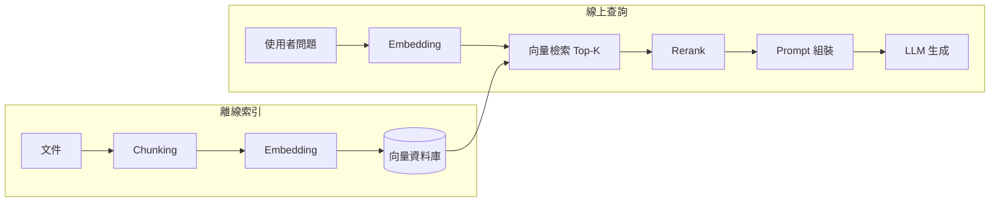

import RagPipelineFlow from '../../components/posts/rag-fundamentals/RagPipelineFlow.tsx';
import ChunkSizeChart from '../../components/posts/rag-fundamentals/ChunkSizeChart.tsx';

LLM 知道的東西停在訓練資料的截止日,也不知道你公司內部的任何文件。RAG(Retrieval-Augmented Generation)用最直觀的方式補上這塊:回答之前,先把相關資料「檢索」出來塞進 prompt。概念一句話講完,但每個環節都有坑。這篇把 pipeline 拆開來一段一段看。

## 整體流程

先看全貌。一個典型的 RAG pipeline 長這樣:



重點:左半邊是**離線**的(文件進來時做一次),右半邊是**線上**的(每個問題都要跑)。兩邊用同一個 embedding 模型,不然向量空間對不上。

## 逐步走一遍

下面這張圖可以按「下一步」逐步看資料怎麼流(節點也可以拖曳):

<RagPipelineFlow client:visible />

## Chunking:最不起眼但影響最大的一步

文件不能整篇塞進向量資料庫 —— embedding 模型有長度上限,而且檢索的粒度太粗會撈回一堆不相關內容。所以要切塊(chunking)。切多大是第一個要做的取捨:

- **chunk 太小**:單一 chunk 缺乏上下文,recall 差 —— 答案被切碎在多個 chunk 裡,撈不齊。
- **chunk 太大**:recall 起初變好,但塞進 prompt 的雜訊變多,生成的 faithfulness(忠實度)下滑,成本也上升。

下面的互動圖表可以切換 overlap 比例,觀察兩個指標的走勢(示意資料):

<ChunkSizeChart client:visible />

一般起手式:**512 tokens 左右、10–20% overlap**,再依評測結果調整。比大小更重要的是**切在語意邊界上**(標題、段落),而不是硬切固定長度。

## 檢索之後:Rerank 為什麼值得

向量相似度是「快而粗」的篩選 —— bi-encoder 把問題和文件分開編碼,只能抓大方向。Rerank 用 cross-encoder 把「問題 + 候選 chunk」一起讀,精準得多但貴得多。所以流程設計成漏斗:向量檢索先撈 Top-50,rerank 從中挑 Top-5 進 prompt。錢花在刀口上。

## RAG 知識地圖

整個領域的知識架構,可以收合展開慢慢看:

```markmap
# RAG
## 索引階段
### Chunking
#### 固定長度 vs 語意切分
#### Overlap 策略
### Embedding
#### 模型選擇
#### 維度與成本
## 檢索階段
### 向量檢索(Top-K)
### 混合檢索(+BM25)
### Rerank(cross-encoder)
## 生成階段
### Prompt 組裝
### 引用來源
### 幻覺抑制
## 評測
### Recall / Precision
### Faithfulness
### 端到端評測
```

## 常見陷阱

1. **只評測生成、不評測檢索。** 檢索撈錯,後面全錯。先量 retrieval recall,再量端到端。
2. **索引和查詢用了不同的 embedding 模型版本。** 向量空間不相容,相似度失去意義。
3. **把 RAG 當萬靈丹。** 需要跨文件推理、彙總統計的問題,單輪檢索救不了,要考慮 agentic 檢索或預先彙整。

## 結語

RAG 的本質是工程,不是魔法:每個環節都是明確的取捨,而取捨要靠評測數字說話。先讓 pipeline 跑起來,再用評測驅動逐段優化 —— 這比一開始就堆滿花式技巧有效得多。
