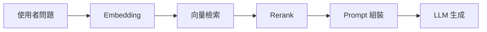

import RagPipelineFlow from '../../components/posts/rag-fundamentals/RagPipelineFlow.tsx';
import ChunkSizeChart from '../../components/posts/rag-fundamentals/ChunkSizeChart.tsx';

RAG(Retrieval-Augmented Generation)是把「檢索」接到「生成」前面的架構。本文骨架,內容由後續 task 補完。



<RagPipelineFlow client:visible />

<ChunkSizeChart client:visible />

```markmap
# RAG
## 索引
### Chunking
### Embedding
## 檢索
### Top-K
### Rerank
## 生成
### Prompt 組裝
### 引用來源
```
